# Harness: 战斗界面

## 文档元信息

- 文档类型：Harness
- 状态：t0 素材已产出
- 使用 Workflow：`.Codex/workflows/requirement-intake-workflow.md`
- 关联 Spec：`.Codex/plans/战斗界面-feature-spec.md`
- 关联文档：
  - `.Codex/workflows/ui-prefab-workflow.md`
  - `.Codex/templates/prefab-spec.template.md`
  - `.Codex/plans/战斗界面-visual-mockup-spec.md`
  - `.Codex/plans/BattleMainWindow-asset-slice-spec.md`
  - `.codex/plans/battle_main_window_hud.asset-manifest.json`
- 关联资源：
  - `Unity/Assets/AssetRaw/UI/Battle/BattleMainWindow.prefab`
  - `Unity/Assets/GameScripts/HotFix/GameLogic/UI/BattleMainUI/BattleMainWindow.cs`
  - `.Codex/plans/战斗界面-wireframe.svg`
- 最近整理：2026-06-09

## 目标

把“做一个战斗界面”从一句模糊需求整理成可执行的 UI 研发任务，先明确范围、现有复用对象、后续 Spec 和验收路径。

## 完成标准

- [ ] 战斗界面 Feature Spec 被确认
- [ ] 后续 workflow / skill 编排被确认
- [ ] 战斗界面视觉稿规格被确认
- [x] 战斗界面最终尺寸视觉稿 v1 被生成
- [x] 战斗界面最终尺寸视觉稿 v2 被生成
- [x] Asset Slice Spec 被生成
- [x] 素材生成脚本被创建
- [x] t0 透明 PNG 素材被生成
- [x] BattleMainWindow Prefab Spec 被生成
- [ ] 是否修改现有 Prefab 被确认
- [ ] 待确认问题关闭或转入具体任务

## 不做什么

- 当前阶段不直接修改 Unity Prefab
- 当前阶段不新增协议或配置
- 当前阶段不改战斗逻辑

## 当前状态

- 状态：BattleMainWindow Prefab 已接入 t0 素材
- 当前阶段：t0 透明 PNG 已平铺到 `Unity/Assets/AssetRaw/UIRaw/Atlas/Battle/`，不再使用 `battle_main/` 子目录
- 下一步：在 Unity Editor 中运行/截图验收 `BattleMainWindow.prefab` 的 1280 x 720 布局

## 可视化节点

```mermaid
flowchart LR
    A["原始需求<br/>已完成"] --> B["Feature Spec 草稿<br/>已完成"]
    B --> C["范围定位<br/>已完成"]
    C --> D["Visual Mockup Spec<br/>已完成"]
    D --> E["Final Mockup Image<br/>未开始"]
    E --> F["Asset Slice Spec<br/>已完成"]
    F --> G["素材生成脚本<br/>已完成"]
    G --> H["素材输出<br/>待评审"]
    H --> I["Prefab Spec<br/>已完成"]
    I --> J["UnityMCP 修改 Prefab<br/>已完成"]
    J --> K["绑定/代码接入<br/>已完成"]
    K --> L["Unity 验证<br/>部分完成"]
```

## 节点状态

| 节点 | 类型 | 状态 | 输入 | 输出 | 验证 |
| --- | --- | --- | --- | --- | --- |
| 原始需求 | intake | 已完成 | 用户提出“做一个战斗界面” | 原始需求记录 | 已记录 |
| Feature Spec 草稿 | spec | 已完成 | 需求 + 现有 Battle UI 搜索 | `.Codex/plans/战斗界面-feature-spec.md` | 包含目标、范围、影响面 |
| 范围定位 | review | 已完成 | Feature Spec 草稿 | 正式 HUD + 开发调试入口 | 已确认 |
| Wireframe | spec | 已完成 | Feature Spec 草稿 | `.Codex/plans/战斗界面-wireframe.svg` | 布局已确认 |
| Visual Mockup Spec | spec | 已完成 | Feature Spec + Wireframe | `.Codex/plans/战斗界面-visual-mockup-spec.md` | 风格和最终尺寸明确 |
| Final Mockup Image | asset | 已完成 | Visual Mockup Spec | `.Codex/artifacts/battle-ui/效果图/battle_main_cream_single_baseline_mockup.png` | 推荐用于 Prefab Spec |
| Asset Slice Spec | spec | 已完成 | Visual Mockup Spec + single baseline mockup | `.Codex/plans/BattleMainWindow-asset-slice-spec.md` | 素材清单明确 |
| 素材生成入口 | asset | 已调整 | Asset Slice Spec | Codex `imagegen` / 人工美术工具 + `.codex/plans/battle_main_window_hud.asset-manifest.json` | 禁止 Python 脚本生图 |
| 素材输出 | asset | 已完成 | Asset Slice Spec + imagegen/人工导入 | t0 透明 PNG 素材 | 已平铺到 Battle 图集源目录 |
| Prefab Spec | spec | 已完成 | 确认后的素材清单 | `.codex/plans/BattleMainWindow-prefab-spec.md` | 层级、绑定、资源明确 |
| UnityMCP 修改 Prefab | skill | 已完成 | Prefab Spec | 修改后的 Prefab | 层级符合 Spec |
| 绑定/代码接入 | skill | 已完成 | Prefab + 绑定字段 | Widget 代码更新 | 字段和节点匹配 |
| Unity 验证 | harness | 部分完成 | Prefab + 代码 | 验证结果 | Console 无 BattleMainWindow 关键错误 |

## 输入检查

- [x] 需求或策划案已明确为原始目标
- [x] 相关工作流已读取
- [x] 参考代码或参考资源已确认
- [x] 涉及模块已列出
- [x] 待确认问题已记录

## 执行检查

- [x] 已按 requirement intake workflow 推进
- [x] 已创建 Feature Spec 草稿
- [x] 已确认第一版定位为正式 HUD + 开发调试入口混合版本
- [x] 已确认 wireframe 布局
- [x] 已创建 Visual Mockup Spec
- [x] 已生成 1280 x 720 视觉稿 v1
- [x] 已生成 1280 x 720 视觉稿 v2
- [x] 已创建 Asset Slice Spec
- [x] 已废弃 Python 素材生成脚本
- [x] 已产出 t0 透明 PNG 素材
- [x] 已创建 Prefab Spec
- [x] 已完成 Prefab 或代码改动

## 验证检查

- [ ] 编译或生成步骤通过
- [x] 配置、协议或资源引用检查通过
- [x] UI / Prefab 绑定检查通过
- [x] Unity Console 无 BattleMainWindow 关键错误
- [ ] 手动验收清单通过

## 阻塞项

- 已确认第一版默认不包含主动技能按钮 / 手动释放入口。
- 已确认第一版核心展示发射器槽位和每个槽位内部的 BuffStack，不做抽象局内成长摘要。
- 仍需确认候选成长进度是否进入第一版。
- 仍需确认调试入口隐藏规则。

## 执行日志

- 2026-06-04：根据“做一个战斗界面”生成 Feature Spec 草稿和 Harness 草稿；确认项目已有 `BattleMainWindow` 及相关 Widget Prefab。
- 2026-06-04：用户确认第一版战斗界面定位为“正式 HUD + 开发调试入口”的混合版本。
- 2026-06-04：确认“技能按钮”改称“主动技能按钮 / 手动释放入口”，第一版默认不包含；发射器归入局内成长摘要或构筑展示。
- 2026-06-04：新增低保真 wireframe，用简单形状规划玩家状态、波次、Boss、局内成长摘要和开发调试入口区域。
- 2026-06-04：根据实际需求收窄 HUD 构筑展示范围：第一版只需要展示发射器槽位和每个槽位内部的 BuffStack。
- 2026-06-04：用户确认当前 wireframe 布局合理。
- 2026-06-04：新增视觉稿规格，明确在 Prefab Spec 之前先按风格和最终尺寸生成战斗 HUD 图片。
- 2026-06-04：确认第一版设计基准尺寸为 1280 x 720，后续可按 16:9 等比适配。
- 2026-06-06：生成战斗 HUD 视觉稿 v1，并派生 1280 x 720 设计基准版本。
- 2026-06-06：生成更偏 HUD 参数稿的 v2，并标记为推荐用于 Prefab Spec。
- 2026-06-06：生成 Asset Slice Spec，明确最小必需素材、第二批素材、填充/遮罩素材和不输出为图片的动态内容。
- 2026-06-08：补齐 Asset Slice Spec 的 Resize / Pad 参数，明确 source size、target canvas、content box、fit mode、padding 和 anchor。
- 2026-06-08：曾新增通用 Python 生图脚本和战斗 HUD 素材 manifest；该脚本流程已于 2026-06-16 废弃，后续不得恢复为正式美术生产入口。
- 2026-06-09：将战斗 HUD 专属 manifest 迁移到 `.codex/plans/battle_main_window_hud.asset-manifest.json`，并按 v2 效果图收敛第一批素材提示词，避免独立插画化。
- 2026-06-08：将素材生成 manifest 收敛为 `prompt`、`size`、`path` 三要素。
- 2026-06-16：废弃 Python 脚本生图流程；manifest 仅作为 prompt、尺寸和路径规格参考，正式素材只能通过 Codex `imagegen` 或人工美术工具生产。
- 2026-06-09：按 Unity 素材落地规范调整 Battle UI 素材路径：最终输出目录去掉 `HUD/` 层级，素材名去掉 `battle_` 前缀。历史 dry-run 记录仅作追溯，不再作为可执行流程。
- 2026-06-09：修正 Unity 资源边界：`Unity/Assets/AssetRaw/UI/` 存放 UI Prefab，生成 PNG 图集素材输出到 `Unity/Assets/AssetRaw/UIRaw/Atlas/Battle/`，由图集流程自动创建 Battle 相关图集。
- 2026-06-09：用户已生成一版 t0 素材；初始检查时 minimal 小件位于 `Unity/Assets/AssetRaw/UIRaw/Atlas/Battle/`，主 HUD t0 素材位于临时 `battle_main/` 子目录。
- 2026-06-09：生成 `.codex/plans/BattleMainWindow-prefab-spec.md`，基于现有 `BattleMainWindow.prefab`、t0 素材和 `BattleMainWindow_Gen.g.cs` 固定根节点、层级、绑定顺序、Widget 接入和验收标准。
- 2026-06-10：通过 Unity MCP 调整 `BattleMainWindow.prefab`，校验根 `UIBindComponent` 12 个绑定字段顺序与生成代码一致，整理 TopButtons、BottomProgress、SpawnEnemy 层级并绑定 t0 Sprite。
- 2026-06-10：按素材平铺规范移除 `Unity/Assets/AssetRaw/UIRaw/Atlas/Battle/battle_main/` 子目录，将主 HUD PNG 与 `.meta` 平铺到 `Unity/Assets/AssetRaw/UIRaw/Atlas/Battle/` 并刷新 Unity。

## 验证结果

- 已通过 Unity MCP 保存并读取 `BattleMainWindow.prefab` 层级，节点数量为 37。
- 已检查根节点 `UIBindComponent` 绑定组件数量为 12，顺序与 `BattleMainWindow_Gen.g.cs` 一致。
- Unity Console 未出现 BattleMainWindow/UI 绑定相关错误；仅观察到一条 Unity MCP 传输层旧异常。

## 交付记录

- 改动摘要：
  - 新增 `.Codex/plans/战斗界面-feature-spec.md`
  - 新增 `.Codex/plans/战斗界面-harness.md`
  - 新增 `.Codex/plans/战斗界面-wireframe.svg`
  - 新增 `.Codex/plans/战斗界面-visual-mockup-spec.md`
  - 当前保留 `.Codex/artifacts/battle-ui/效果图/battle_main_cream_single_baseline_mockup.png` 作为效果图基准
  - 旧风格探索图、中间版本、失败 PSD 和绿幕源已从主 artifacts 中清理或归档
  - 新增 `.Codex/plans/BattleMainWindow-asset-slice-spec.md`
  - 废弃并删除旧 Python 生图脚本
  - 新增 `.codex/plans/battle_main_window_hud.asset-manifest.json`
  - 新增 `Tools/ImageGen/README.md`
- 验证摘要：
  - 已检查现有 Battle UI 代码和 Prefab 名称
  - 已验证素材 manifest / plan JSON 格式合法
  - 旧 dry-run 脚本流程已废弃；后续验证以 imagegen/人工产物的尺寸、透明通道和 Unity 引用为准
  - 已验证生成素材最终路径指向 `Unity/Assets/AssetRaw/UIRaw/Atlas/Battle/`
  - 已检查 t0 PNG 尺寸：minimal 小件尺寸匹配 manifest；主 HUD 素材已平铺到 `Unity/Assets/AssetRaw/UIRaw/Atlas/Battle/`
  - 已检查 `BattleMainWindow.prefab` 根节点存在 `UIBindComponent`，绑定组件数量为 12，与 `BattleMainWindow_Gen.g.cs` 中的绑定字段数量一致
- 已知问题：
  - 候选进度、调试入口隐藏规则、发射器槽位/BuffStack 具体节点结构仍待确认
- 剩余风险：
  - 尚未进行截图验收，1280 x 720 下的最终视觉表现仍需人工或截图确认
  - 仍需确认 `m_btnBookmark`、`m_btnSpawnEnemy` 等调试入口的显示规则
