# 战斗模块时序图

> 基于 Server/Hotfix/Demo/Battle/ 及相关代码生成，使用 Mermaid 时序图表示，随代码同步更新。

---

## Phase 1: 战斗准备

```mermaid
sequenceDiagram
    participant Client as 客户端
    participant Server as 服务端 (Map)

    Client->>Server: C2M_TeamStartBattle(battleType, stageId)
    Note over Server: C2M_TeamStartBattleHandler
    Server->>Server: 校验玩家状态 (是否已在战斗中)
    Server->>Server: 获取/创建 BattleRoomManagerComponent
    Server->>Server: mapScene.AddChild<BattleRoom>(configId)
    Note over Server: BattleRoomSystem.Awake<br/>├─ State = Prepare<br/>├─ SlotManagerComponent<br/>├─ BattleSpatialGrid(5f)<br/>├─ SkillTimelineComponent<br/>└─ BossSyncComponent
    Server->>Server: battleRoom.AddPlayer(playerId)
    Server->>Server: roomManager 注册映射
    Server->>Server: battleRoom.InitTeamBattle(mapScene, memberIds, battleType)

    rect rgb(40, 44, 52)
        Note over Server: InitTeamBattle 内部
        Server->>Server: UnitFactory.CreateHero(battleRoom, unitId, configId, pos)<br/>NumericComponent + BuffComponent + CombatComponent
        Server->>Server: spatialGrid.Insert(unit.Id, position.X)
        opt battleType == 2 (Boss战)
            Server->>Server: UnitFactory.CreateMonster(battleRoom, configId, pos)<br/>+ BattleMoveComponent(100ms) + DecisionComponent(100ms)
            Server->>Server: Publish BossCreatedEvent → BossSyncComponent.RegisterBoss
        end
        Server->>Server: AddComponent<WaveManagerComponent>(stageId, waveConfigIds)
    end

    Server-->>Client: M2C_TeamStartBattle(battleId, memberIds)
```

---

## Phase 2: 进入战斗 (刷怪)

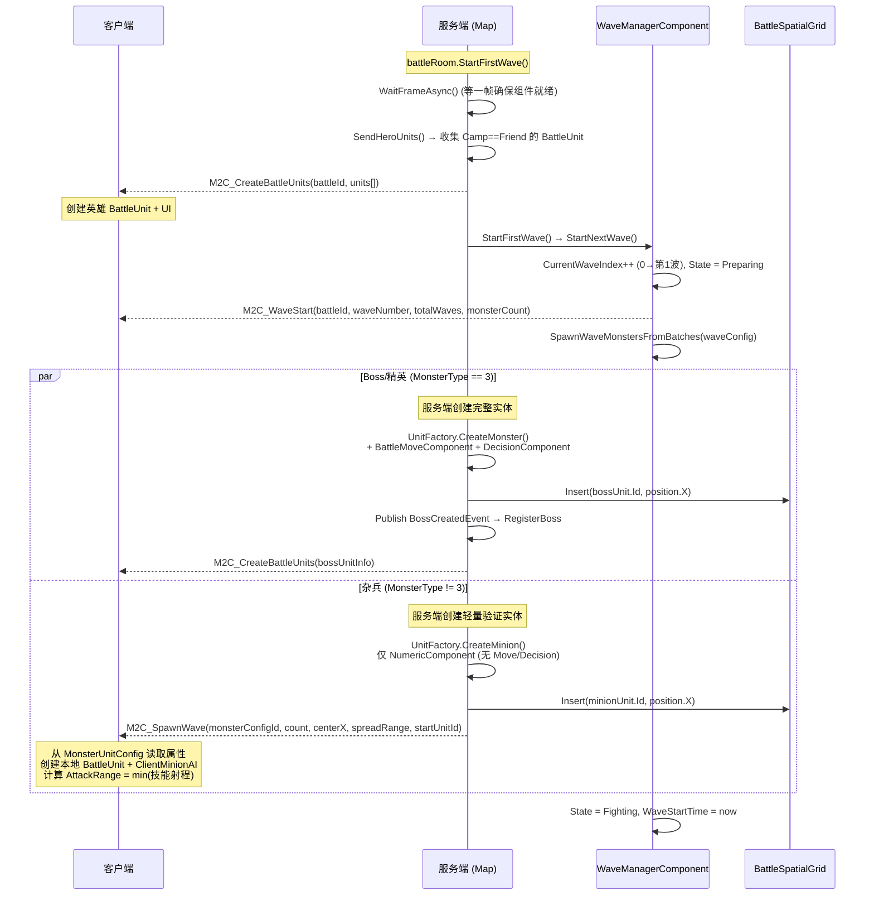

---

## Phase 3.1: 战斗循环总览

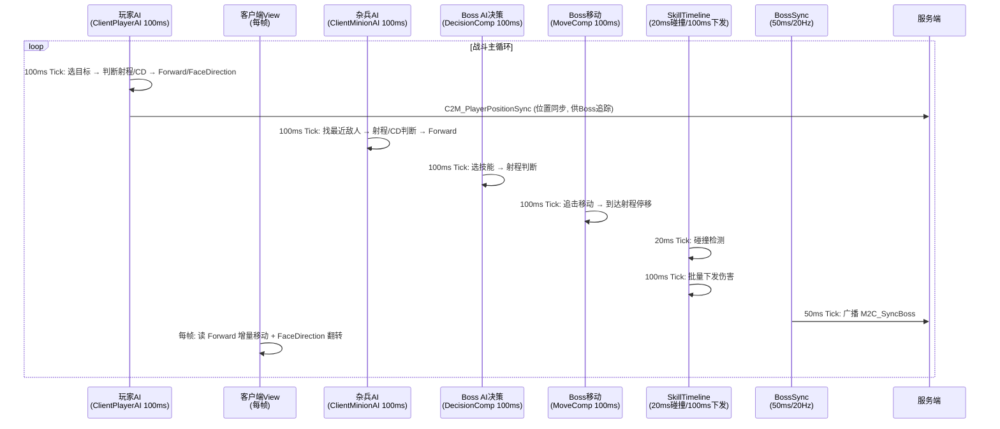

---

## Phase 3.2: 玩家攻击杂兵 (Track A — 客户端权威)

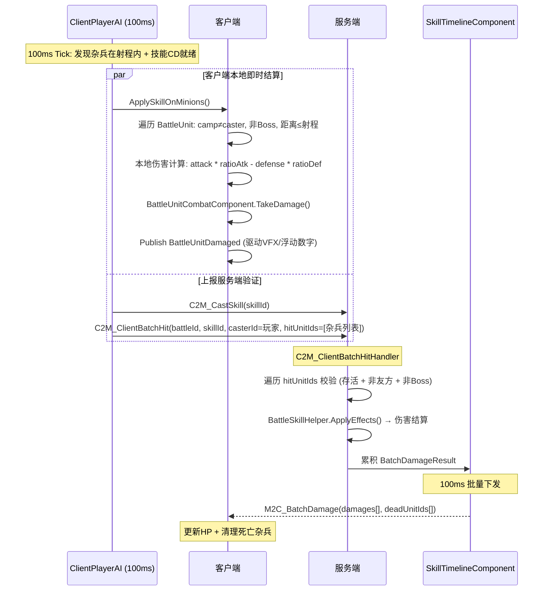

---

## Phase 3.3: 杂兵攻击玩家 (Track A — 客户端权威)

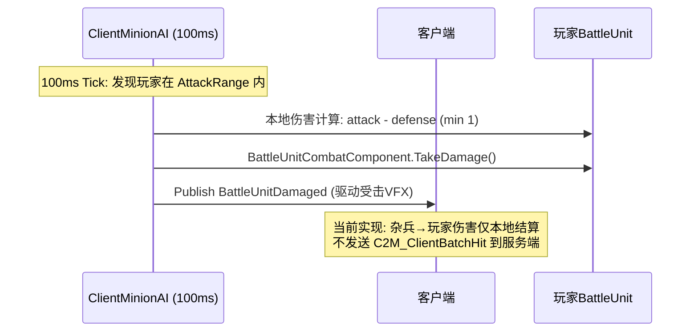

---

## Phase 3.4: 玩家攻击Boss (Track B — 服务端权威)

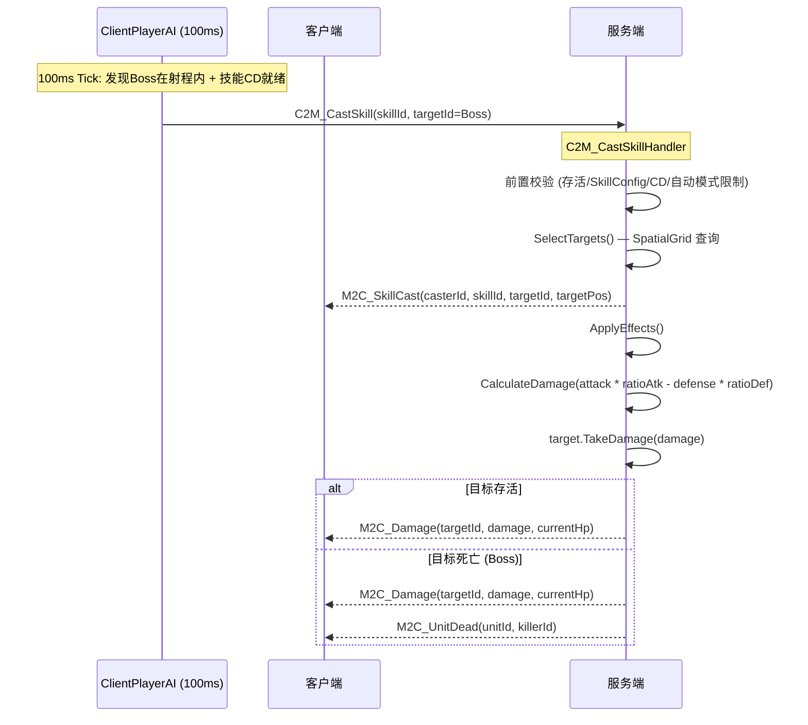

---

## Phase 3.5: Boss攻击玩家 (Track B — 服务端权威)

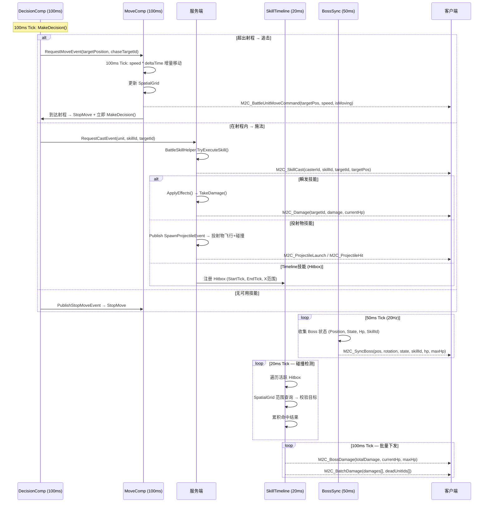

---

## Phase 3.6: Boss 状态中断 (冻结/击退/施法结束)

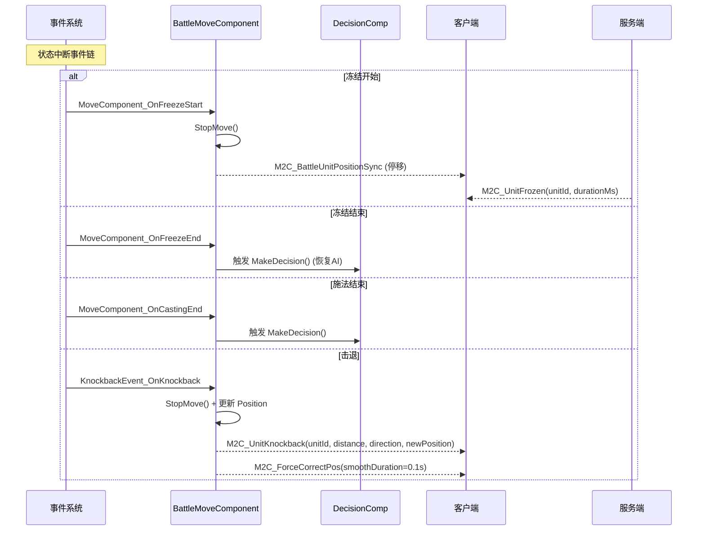

---

## Phase 3.7: 玩家自动战斗AI (100ms Tick)

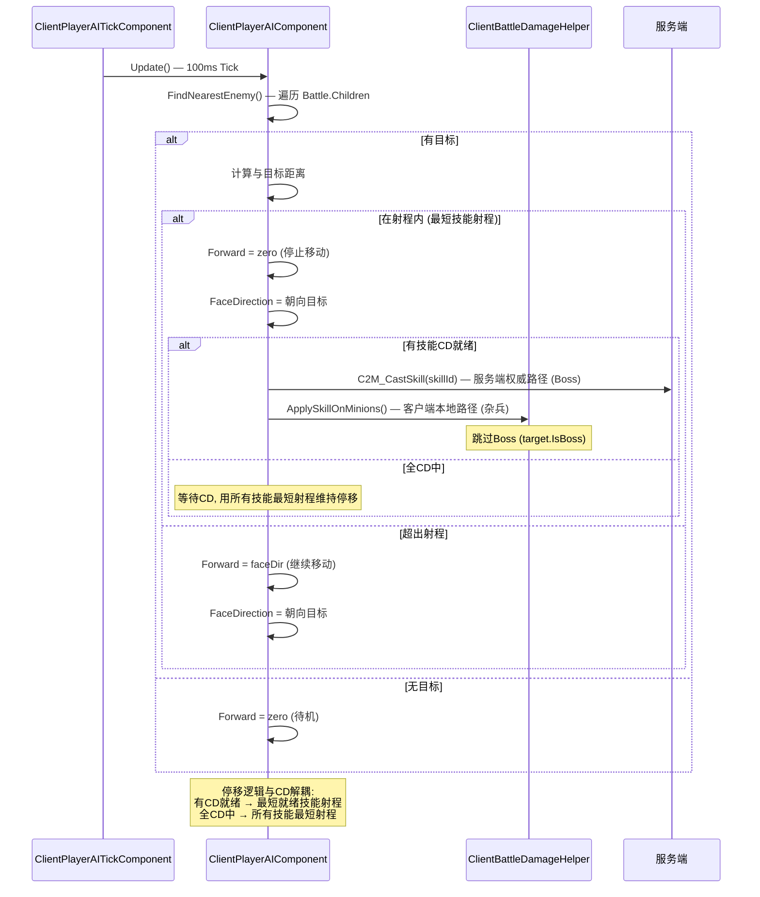

---

## Phase 3.8: 杂兵自动AI (100ms Tick)

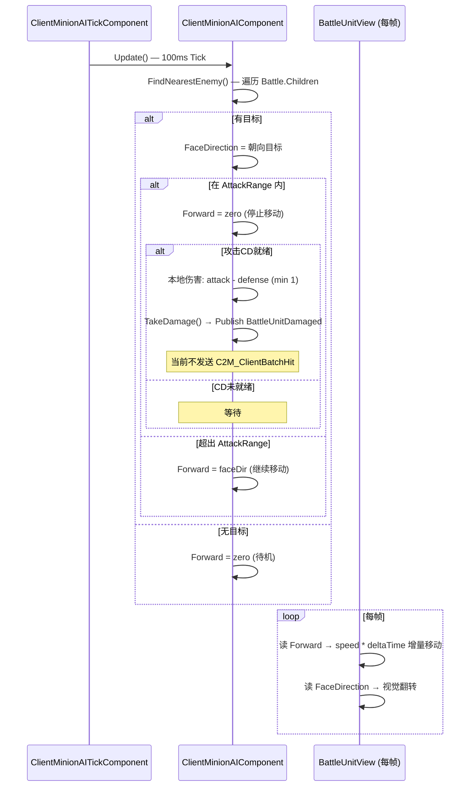

---

## Phase 4: 波次推进

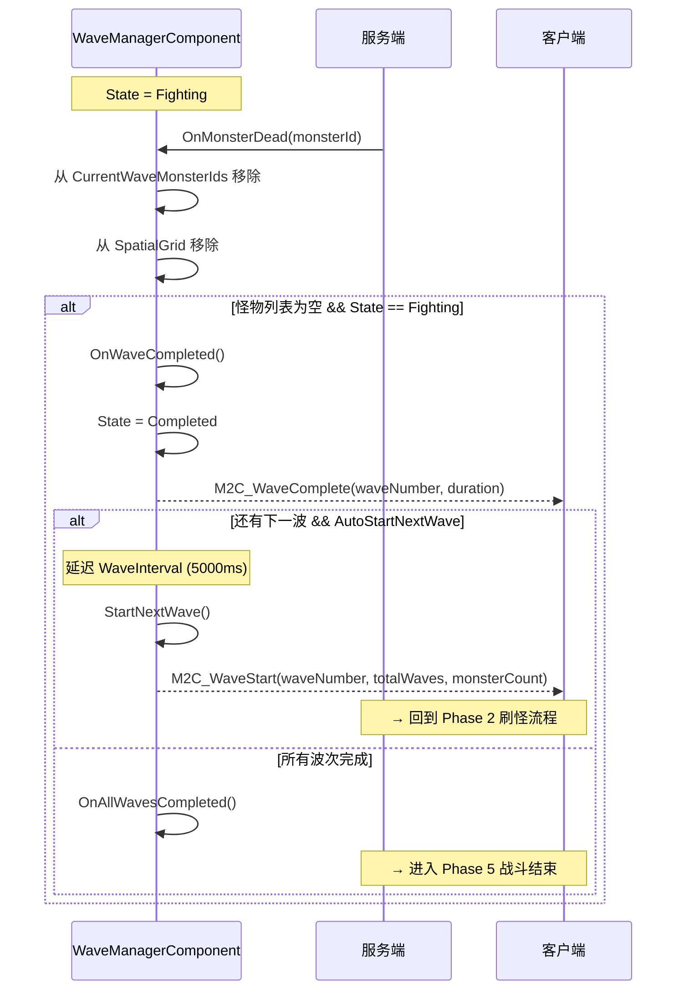

---

## Phase 5: 战斗结束

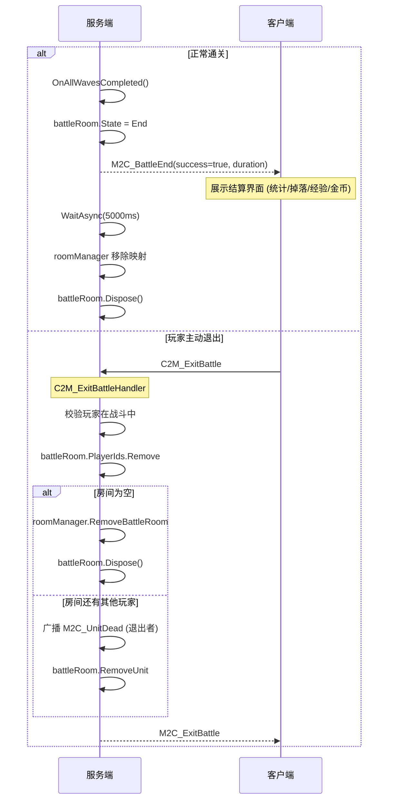

---

## 全局 Tick 时序对照

```mermaid
gantt
    title 各系统 Tick 频率对照
    dateFormat X
    axisFormat %Lms

    section 客户端
    View层 (每帧 ~16ms)       :crit, view, 0, 16
    PlayerAI (100ms)          :ai1, 0, 100
    MinionAI (100ms)          :ai2, 0, 100

    section 服务端
    DecisionComp (100ms)      :dec, 0, 100
    MoveComp (100ms)          :mov, 0, 100
    BossSync (50ms)           :sync, 0, 50
    Timeline碰撞 (20ms)       :tick, 0, 20
    Timeline下发 (100ms)      :flush, 0, 100
```

---

## 关键消息汇总

| 方向 | 消息 | 触发时机 | 说明 |
|------|------|----------|------|
| C→S | `C2M_TeamStartBattle` | 开始战斗 | ILocationRequest |
| S→C | `M2C_TeamStartBattle` | 战斗房间创建 | 返回 battleId + memberIds |
| S→C | `M2C_CreateBattleUnits` | 英雄/Boss创建 | 含完整属性 unitId/configId/camp/pos/hp |
| S→C | `M2C_WaveStart` | 波次开始 | waveNumber/totalWaves/monsterCount |
| S→C | `M2C_SpawnWave` | 杂兵刷怪 | configId/count/centerX/spreadRange/startUnitId |
| C→S | `C2M_PlayerPositionSync` | 玩家移动 | ILocationMessage, 供Boss追踪 |
| C→S | `C2M_CastSkill` | 手动施法 | ISessionRequest, 服务端权威路径 |
| S→C | `M2C_SkillCast` | 广播施法 | casterId/skillId/targetId/targetPos |
| S→C | `M2C_BattleUnitMoveCommand` | Boss移动指令 | targetPos/speed/isMoving/duration |
| S→C | `M2C_SyncBoss` | Boss状态同步 | 20Hz: pos/state/skillId/hp |
| C→S | `C2M_ClientBatchHit` | 双向命中上报 | 玩家→杂兵 / 杂兵→玩家 |
| S→C | `M2C_BatchDamage` | 批量伤害 | 100ms: damages[] + deadUnitIds[] |
| S→C | `M2C_BossDamage` | Boss伤害 | 100ms: totalDamage/currentHp/maxHp |
| S→C | `M2C_Damage` | 单次伤害 | 服务端技能执行结果 |
| S→C | `M2C_UnitDead` | 单位死亡 | 仅Boss死亡时单独广播 |
| S→C | `M2C_UnitKnockback` | 击退 | unitId/distance/direction/newPos |
| S→C | `M2C_UnitFrozen` | 冻结 | unitId/durationMs |
| S→C | `M2C_ForceCorrectPos` | 位置纠偏 | smoothDuration=0.1s |
| S→C | `M2C_WaveComplete` | 波次完成 | waveNumber/duration |
| S→C | `M2C_BattleEnd` | 战斗结束 | success/duration |
| C→S | `C2M_ExitBattle` | 退出战斗 | ILocationRequest |

---

## 双轨权威模型总览

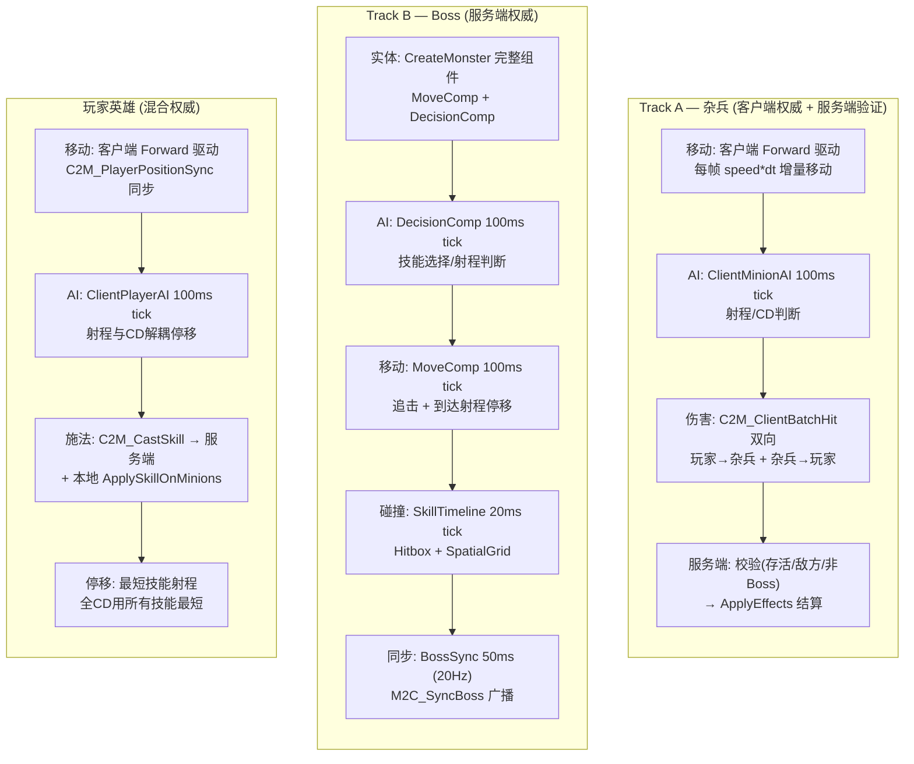

---

## 客户端方向驱动移动模型

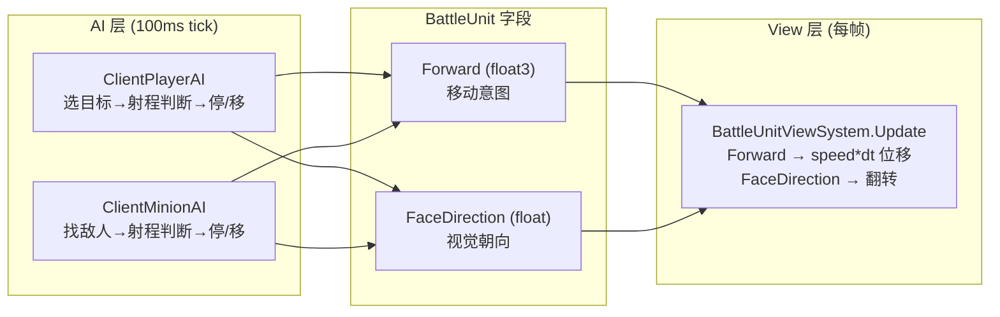

---

## 涉及的关键源文件

| 文件 | 职责 |
|------|------|
| `Server/Hotfix/Demo/Battle/BattleRoomSystem.cs` | 战斗房间生命周期 |
| `Server/Hotfix/Demo/Battle/BattleActionDecisionComponentSystem.cs` | AI决策循环 |
| `Server/Hotfix/Demo/Battle/BattleMoveComponentSystem.cs` | 服务端移动+事件处理 |
| `Server/Hotfix/Demo/Battle/BattleSkillHelper.cs` | 技能选择/执行/伤害计算 |
| `Server/Hotfix/Demo/Battle/SkillTimelineComponentSystem.cs` | 技能碰撞检测 |
| `Server/Hotfix/Demo/Battle/EffectApplyComponentSystem.cs` | 效果结算 |
| `Server/Hotfix/Demo/Battle/WaveManagerComponentSystem.cs` | 波次管理 |
| `Server/Hotfix/Demo/Battle/PlayerCombatModeComponentSystem.cs` | 自动/手动模式 |
| `Server/Hotfix/Demo/Battle/Event/DamageEvent_OnDamage.cs` | 伤害事件→广播 |
| `Server/Hotfix/Demo/Map/Unit/UnitFactory.cs` | 单位创建工厂 |
| `Server/Hotfix/Demo/Battle/Handler/C2M_TeamStartBattleHandler.cs` | 开始战斗入口 |
| `Server/Hotfix/Demo/Battle/Handler/C2M_CastSkillHandler.cs` | 手动施法入口 |
| `Server/Hotfix/Demo/Battle/Handler/C2M_ClientBatchHitHandler.cs` | 双向命中上报(玩家↔杂兵) |
| `Server/Hotfix/Demo/Battle/Handler/C2M_ExitBattleHandler.cs` | 退出战斗 |
| `Server/Hotfix/Demo/Battle/BattleUnitHelper.cs` | 消息广播工具 |
| `Unity/.../BattleUnit.cs` | 战斗单位实体(Forward/FaceDirection) |
| `Unity/.../ClientPlayerAIComponentSystem.cs` | 客户端玩家AI(方向驱动+射程停移) |
| `Unity/.../ClientMinionAIComponentSystem.cs` | 客户端杂兵AI(方向驱动+攻击上报) |
| `Unity/.../ClientPlayerAITickComponentSystem.cs` | 玩家AI Tick驱动(100ms) |
| `Unity/.../ClientMinionAITickComponentSystem.cs` | 杂兵AI Tick驱动(100ms) |
| `Unity/.../View/BattleUnitViewSystem.cs` | 每帧增量移动+视觉翻转 |
| `Unity/.../Handler/M2C_SpawnWaveHandler.cs` | 客户端杂兵创建+射程配置 |
| `Unity/.../Handler/M2C_BattleUnitMoveCommandHandler.cs` | Boss移动指令处理 |
| `Unity/.../Handler/M2C_CreateBattleUnitsHandler.cs` | 玩家英雄创建 |
