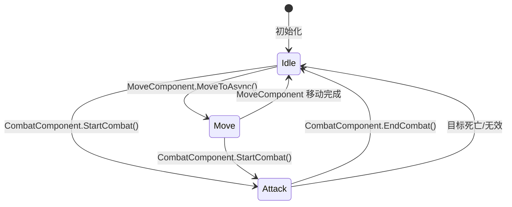
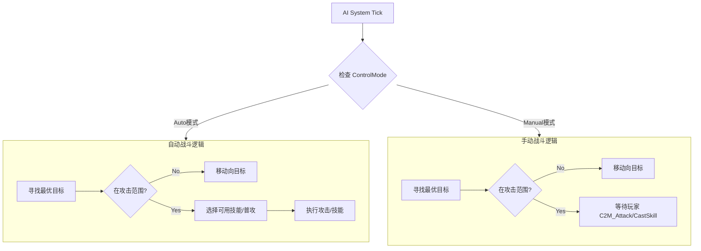

# ET Roguelike 核心实现架构文档

> **文档定位**：技术实现方案 - 玩家行为与战斗系统  
> **适用框架**：ET 8.1+  
> **更新日期**：2026-01-26  
> **文档版本**：v2.0

## 📋 目录导航

- [1. 实体层级架构](#1-实体层级架构-entity-hierarchy)
- [2. 玩家行为系统实现](#2-玩家行为系统实现)
- [3. 状态机系统详解](#3-状态机系统详解)
- [4. 混合模式决策逻辑](#4-混合模式决策逻辑)
- [5. 关键代码实现示例](#5-关键代码实现示例)
- [6. 验证测试计划](#6-验证测试计划)
- [7. 性能优化建议](#7-性能优化建议)
- [8. 常见问题与故障排查](#8-常见问题与故障排查)
- [9. 开发逻辑时间线](#9-开发逻辑时间线)

---

## 1. 实体层级架构 (Entity Hierarchy)

ET框架采用实体组件系统（ECS），以下是本系统的核心实体层级关系图：

```mermaid
graph TD
    Root[Root] --> Scene[Scene (Map/Room)]
    
    %% 房间与战斗容器
    Scene --> Room[Room (Entity)]
    Room --> BattleComp[BattleComponent]
    Room --> WaveComp[WaveManagerComponent]
    Room --> RoomUnitComp[RoomUnitComponent]
    
    %% 单位实体结构
    RoomUnitComp --> Unit[Unit (Entity)]
    
    %% 玩家/怪物共用组件
    Unit --> NumComp[NumericComponent (数值)]
    Unit --> SkillComp[SkillComponent (技能)]
    Unit --> BuffComp[BuffComponent (状态)]
    Unit --> StateComp[StateMachineComponent (状态机)]
    Unit --> StatusComp[StatusFlagsComponent (标记)]
    Unit --> CombatComp[CombatComponent (战斗)]
    
    %% 玩家特有组件
    Unit --> ModeComp[PlayerControlModeComponent (操作模式)]
    Unit --> PlayerAIComp[PlayerAIComponent (自动决策)]
    
    %% 怪物特有组件
    Unit --> MonsterAIComp[MonsterAIComponent (怪物AI)]
    
    %% 状态机子组件
    StateComp --> IdleState[IdleStateComponent]
    StateComp --> MoveState[MoveStateComponent]
    StateComp --> AttackState[AttackStateComponent]
```

### 核心组件说明

| 组件名称 | 层级关系 | 职责描述 |
| :--- | :--- | :--- |
| **Room** | Scene子级 | 战斗房间实体，承载一场完整的战斗局 |
| **BattleComponent** | Room组件 | 战斗状态管理、战斗结算、全局逻辑 |
| **RoomUnitComponent** | Room组件 | 管理房间内的所有Unit（玩家+怪物） |
| **Unit** | RoomUnitComponent子级 | 游戏单位实体（玩家或怪物） |
| **PlayerControlModeComponent** | Unit组件 | **[新增]** 管理自动/手动模式状态及切换逻辑 |
| **PlayerAIComponent** | Unit组件 | **[新增]** 玩家自动战斗的决策大脑 |
| **StateMachineComponent** | Unit组件 | 行为状态机（Idle/Move/Attack），驱动实际行为 |

---

## 2. 玩家行为系统实现

### 2.1 玩家控制模式组件 (PlayerControlModeComponent)

**定位**：管理玩家的自动/手动状态，处理模式切换。

**设计要点**：
- ✅ 默认为自动模式（Auto），符合Roguelike快节奏体验
- ✅ 支持运行时动态切换，无需重启战斗
- ✅ 内置冷却机制（1秒），防止误操作和网络抖动
- ✅ 模式状态会广播给房间内所有玩家（用于UI同步）

```csharp
// Model/Share/Module/Unit/PlayerControlModeComponent.cs
namespace ET
{
    /// <summary>
    /// 玩家控制模式枚举
    /// </summary>
    public enum ControlMode
    {
        Auto = 0,   // 自动模式（默认）- AI自动寻路和攻击
        Manual = 1  // 手动模式 - AI仅自动寻路，攻击需玩家指令
    }

    /// <summary>
    /// 玩家控制模式组件
    /// 挂载在玩家Unit上，管理自动/手动战斗模式
    /// </summary>
    [ComponentOf(typeof(Unit))]
    public class PlayerControlModeComponent : Entity, IAwake
    {
        /// <summary>
        /// 当前控制模式
        /// </summary>
        public ControlMode CurrentMode { get; set; } = ControlMode.Auto;
        
        /// <summary>
        /// 上次切换时间（毫秒时间戳）
        /// 用于实现切换冷却，防止频繁操作
        /// </summary>
        public long LastSwitchTime { get; set; }
    }
}
```

**使用场景**：
- 🎮 玩家希望手动控制技能释放时机（Boss战、PVP）
- 🤖 玩家希望挂机刷怪时自动战斗（日常副本、经验本）
- 🔄 战斗中途根据情况动态调整策略

### 2.2 玩家AI组件 (PlayerAIComponent)

**定位**：负责自动模式下的目标选择和技能决策。

**核心职责**：
- 🎯 **目标选择**：在搜索范围内寻找最优敌人（距离最近、血量最低等策略）
- 🚶 **自动寻路**：当目标超出攻击范围时，自动移动接近
- ⚔️ **攻击决策**：在Auto模式下自动执行普攻或技能释放
- ⏱️ **定时决策**：通过Timer定时触发（默认500ms），避免每帧计算

```csharp
// Model/Server/Demo/Unit/PlayerAIComponent.cs
namespace ET.Server
{
    /// <summary>
    /// 玩家AI组件（服务端）
    /// 负责自动战斗的决策逻辑
    /// </summary>
    [ComponentOf(typeof(Unit))]
    public class PlayerAIComponent : Entity, IAwake, IDestroy
    {
        /// <summary>
        /// 定时器ID（用于清理）
        /// </summary>
        public long ScanTimer { get; set; }
        
        /// <summary>
        /// 决策间隔（毫秒）
        /// 默认500ms，平衡性能和响应速度
        /// </summary>
        public long ScanInterval { get; set; } = 500;
        
        /// <summary>
        /// 搜索范围（米）
        /// 超出此范围的敌人不会被AI感知
        /// </summary>
        public float SearchRange { get; set; } = 20.0f;
        
        /// <summary>
        /// 攻击范围（米）
        /// 应根据武器类型动态调整（近战2-3米，远程5-10米）
        /// </summary>
        public float AttackRange { get; set; } = 3.0f;
    }
}
```

**性能优化建议**：
- ⚡ `ScanInterval` 建议范围：300-1000ms（过低影响性能，过高影响体验）
- 📍 `SearchRange` 应小于场景视野范围，避免感知不可见敌人
- 🎯 可根据战斗强度动态调整间隔（激烈战斗时缩短，和平时延长）

### 2.3 消息协议定义

**协议设计原则**：
- 🔒 使用 `ISessionRequest/ISessionResponse` 保证请求-响应一致性
- 📢 使用 `IMessage` 实现服务器主动推送（广播）
- ✅ 包含错误码和错误信息，便于客户端处理异常

```protobuf
// Config/Proto/OuterMessage_C_10001.proto

//==================== 玩家控制模式切换 ====================

/// <summary>
/// 客户端请求切换控制模式
/// </summary>
message C2M_SwitchControlMode // ISessionRequest
{
    int32 RpcId = 1;
    int32 Mode = 2; // 0: Auto, 1: Manual
}

/// <summary>
/// 服务器响应控制模式切换
/// </summary>
message M2C_SwitchControlMode // ISessionResponse
{
    int32 RpcId = 1;
    int32 Error = 2;           // 错误码（0表示成功）
    string Message = 3;        // 错误信息（用于调试和提示）
    int32 CurrentMode = 4;     // 切换后的当前模式
}

/// <summary>
/// 广播控制模式变化（通知房间内其他玩家）
/// 用于同步UI状态，如队友头像上的"自动/手动"标识
/// </summary>
message M2C_ControlModeChanged // IMessage
{
    int64 UnitId = 1;          // 切换模式的玩家UnitId
    int32 NewMode = 2;         // 新的控制模式
}
```

**错误码定义**（需在 `ErrorCode.cs` 中添加）：
```csharp
// Model/Share/Module/Message/ErrorCode.cs
public static class ErrorCode
{
    // ... 其他错误码 ...
    
    public const int ERR_OperationTooFrequent = 100201; // 操作过于频繁
    public const int ERR_PlayerNotExist = 100202;       // 玩家不存在
    public const int ERR_UnitNotFound = 100203;         // Unit未找到
    public const int ERR_InvalidControlMode = 100204;   // 无效的控制模式
}
```

**协议使用流程**：
1. 客户端发送 `C2M_SwitchControlMode`（携带目标模式）
2. 服务器验证冷却、权限，更新 `PlayerControlModeComponent`
3. 服务器返回 `M2C_SwitchControlMode`（包含结果和当前模式）
4. 服务器广播 `M2C_ControlModeChanged` 给房间内所有玩家

---

## 3. 状态机系统详解

### 3.1 状态机架构

`StateMachineComponent` 是Unit的行为状态机，管理三种核心状态。

**设计理念**：
- 🎯 **单一职责**：每个状态只负责一种行为（待机/移动/攻击）
- 🔄 **事件驱动**：状态切换由业务逻辑主动触发，而非状态机轮询
- 🛡️ **防抖保护**：内置转换检查，防止频繁切换导致的抖动
- 📦 **组件化设计**：状态作为子组件挂载在StateMachineComponent下

| 状态 | 组件 | 职责 | 典型触发条件 |
|:---|:---|:---|:---|
| **Idle** | `IdleStateComponent` | 待机状态，等待触发条件 | 移动完成、战斗结束、初始化 |
| **Move** | `MoveStateComponent` | 移动状态，执行寻路移动 | 玩家点击移动、AI追击目标 |
| **Attack** | `AttackStateComponent` | 攻击状态，执行战斗逻辑 | 进入攻击范围、释放技能 |

**状态机层级结构**：
```
Unit (Entity)
└── StateMachineComponent (Entity)
    ├── CurrentState: MachineState (枚举)
    ├── CurrentStateEntity: Entity (当前状态组件引用)
    └── [动态子组件]
        ├── IdleStateComponent (仅当处于Idle时存在)
        ├── MoveStateComponent (仅当处于Move时存在)
        └── AttackStateComponent (仅当处于Attack时存在)
```

**关键特性**：
- ✅ 同一时刻只有一个状态组件存在（切换时销毁旧状态，创建新状态）
- ✅ 状态切换会发布 `UnitStateChangedEvent` 事件，供其他系统监听
- ✅ 支持状态转换权限检查（`CanTransitionTo`），防止非法切换

### 3.2 状态切换条件命名规范

| 条件名称 | 触发时机 | 说明 | 触发切换 |
|:---|:---|:---|:---|
| **HasCombatTarget** | `CombatComponent.StartCombat()` | 开始战斗 | Idle/Move → Attack |
| **HasMoveCommand** | `MoveComponent.MoveToAsync()` | 开始移动 | Idle → Move |
| **MoveArrived** | `MoveComponent.MoveToAsync()` 完成 | 移动完成 | Move → Idle |
| **CombatEnded** | `CombatComponent.EndCombat()` | 战斗结束 | Attack → Idle |
| **TargetInvalid** | 目标死亡/不存在 | 目标无效 | Attack → Idle |

### 3.3 状态切换流程图



### 3.4 事件驱动架构说明

**核心原则**：状态机不主动轮询，由业务逻辑主动通知状态切换。

**设计优势**：
- ⚡ **性能优化**：避免每帧检查状态切换条件，降低CPU开销
- 🎯 **职责清晰**：业务逻辑负责决策，状态机负责执行
- 🔧 **易于维护**：状态切换逻辑集中在业务代码中，便于调试
- 🚀 **响应及时**：事件触发立即生效，无需等待下一次轮询

#### 状态切换触发点

| 业务逻辑 | 触发方法 | 状态切换 | 代码位置 |
|:---|:---|:---|:---|
| **开始战斗** | `CombatComponent.StartCombat()` | → Attack | CombatComponentSystem.cs |
| **结束战斗** | `CombatComponent.EndCombat()` | → Idle | CombatComponentSystem.cs |
| **开始移动** | `MoveComponent.MoveToAsync()` | → Move | MoveComponentSystem.cs |
| **移动完成** | `MoveComponent.MoveToAsync()` 返回 | → Idle | MoveComponentSystem.cs |
| **目标死亡** | `UnitDeadEvent` 处理 | → Idle | UnitDeadEvent_BattleHandler.cs |

#### 实现示例

```csharp
// Hotfix/Server/Demo/ComBat/CombatComponentSystem.cs

/// <summary>
/// 开始战斗（事件驱动状态切换）
/// </summary>
public static void StartCombat(this CombatComponent self, long targetId)
{
    Unit unit = self.GetParent<Unit>();
    self.IsInCombat = true;
    self.TargetId = targetId;
    self.CombatStartTime = TimeInfo.Instance.ServerNow();
    
    Log.Info($"[Combat] 战斗开始 - Unit({unit.Id}) vs Unit({targetId})");
    
    // ✅ 主动通知状态机切换到 Attack 状态
    StateMachineComponent stateMachine = unit.GetComponent<StateMachineComponent>();
    stateMachine?.ChangeState(MachineState.Attack);
}

/// <summary>
/// 结束战斗（事件驱动状态切换）
/// </summary>
public static void EndCombat(this CombatComponent self)
{
    Unit unit = self.GetParent<Unit>();
    self.IsInCombat = false;
    self.TargetId = 0;
    
    Log.Info($"[Combat] 战斗结束 - Unit({unit.Id})");
    
    // ✅ 主动通知状态机切换到 Idle 状态
    StateMachineComponent stateMachine = unit.GetComponent<StateMachineComponent>();
    stateMachine?.ChangeState(MachineState.Idle);
}
```

```csharp
// Hotfix/Server/Demo/Map/Move/MoveHelper.cs (伪代码)

/// <summary>
/// 异步移动到目标位置（事件驱动状态切换）
/// </summary>
public static async ETTask<bool> MoveToAsync(this MoveComponent self, List<float3> target, float speed)
{
    Unit unit = self.GetParent<Unit>();
    
    // ✅ 移动开始时，主动通知状态机切换到 Move 状态
    StateMachineComponent stateMachine = unit.GetComponent<StateMachineComponent>();
    stateMachine?.ChangeState(MachineState.Move);
    
    // 执行移动逻辑...
    bool moveRet = await self.ExecuteMove(target, speed);
    
    if (moveRet)
    {
        // ✅ 移动完成时，主动通知状态机切换到 Idle 状态
        stateMachine?.ChangeState(MachineState.Idle);
    }
    
    return moveRet;
}
```

**⚠️ 反模式警告**：
```csharp
// ❌ 错误做法：在状态机Update中轮询检查
public static void Update(this StateMachineComponent self)
{
    Unit unit = self.GetParent<Unit>();
    CombatComponent combat = unit.GetComponent<CombatComponent>();
    
    // ❌ 不要这样做！每帧检查浪费性能
    if (combat.IsInCombat && self.CurrentState != MachineState.Attack)
    {
        self.ChangeState(MachineState.Attack);
    }
}

// ✅ 正确做法：在业务逻辑中主动触发
public static void StartCombat(this CombatComponent self, long targetId)
{
    // ... 业务逻辑 ...
    
    // ✅ 直接通知状态机切换
    unit.GetComponent<StateMachineComponent>()?.ChangeState(MachineState.Attack);
}
```

### 3.5 状态组件职责

状态组件只负责进入/退出逻辑和转换权限检查，**不负责主动检查切换条件**。

```csharp
// IdleStateComponentSystem.cs
public static void OnStateEnter(this IdleStateComponent self, Unit unit)
{
    // 进入待机状态的初始化逻辑
    self.EnterTime = TimeInfo.Instance.ServerNow();
    
    // 停止移动
    MoveComponent move = unit.GetComponent<MoveComponent>();
    move?.Stop(false);
}

public static void OnStateExit(this IdleStateComponent self, Unit unit)
{
    // 退出待机状态的清理逻辑
    Log.Debug($"[IdleState] Exit: Duration={(TimeInfo.Instance.ServerNow() - self.EnterTime) / 1000f:F2}s");
}

public static bool CanTransitionTo(this IdleStateComponent self, MachineState nextState)
{
    // 防抖：最小待机时长
    long now = TimeInfo.Instance.ServerNow();
    if (now - self.EnterTime < self.MinIdleDuration)
    {
        return false;
    }
    return true;
}
```

### 3.6 状态切换防抖机制

为防止状态频繁切换（如在攻击边缘反复切换），引入以下机制：

1. **IdleState 最小待机时长**：`MinIdleDuration = 200ms`
2. **攻击范围滞后**：建议在AI层使用 `AttackRange * 1.2` 作为脱离战斗的判定距离

### 3.7 状态机与技能系统交互

为支持"移动施法"和解决状态机并发问题，采用**FSM (身体) + Component (能力)** 的分层设计。

| 技能类型 | 移动逻辑 | 状态机行为 | 示例 |
|:---|:---|:---|:---|
| **站桩技能** (硬直) | 强制停止移动 | 切换到 `Attack` 状态 | 蓄力火球、重击 |
| **脱手技能** (移动施法) | 允许继续移动 | **保持** `Move` 或 `Idle` 状态 | 顺劈斩、Buff、光环 |

**实现规范：**

1. `CombatComponent.Attack(target, stopMoving)`：
   - `stopMoving = true`：通知 FSM 切换到 Attack，打断移动。
   - `stopMoving = false`：**不通知** FSM，仅执行伤害/特效逻辑。

2. `SkillComponent.CastSkill(skillId)`：
   - 根据 `SkillConfig.StopMove` 字段决定是否调用 FSM。

---

## 4. 混合模式决策逻辑

### 4.1 控制模式说明

所有玩家Unit都会挂载 `PlayerControlModeComponent` 和 `PlayerAIComponent`。

| 模式 | 自动移动 | 自动攻击 | 玩家输入 |
|:---|:---:|:---:|:---|
| **Auto** | ✓ | ✓ | 忽略攻击指令 |
| **Manual** | ✓ | ✗ | 响应攻击指令 |

### 4.2 服务端 Update 逻辑



### 4.3 攻击请求处理流程 (Handler)

**C2M_Attack / C2M_CastSkill 处理逻辑改造：**

1. **获取组件**：获取 `PlayerControlModeComponent`。
2. **模式校验**：
   - 如果是 `Manual` 模式：允许执行指令。
   - 如果是 `Auto` 模式：**拒绝指令**（或者自动切为手动），防止自动逻辑冲突。
3. **常规校验**：距离、CD、消耗、状态（眩晕/死亡）。
4. **执行**：调用 `CombatComponent` 或 `SkillComponent` 执行。

---

## 5. 关键代码实现示例

### 5.1 玩家AI系统 (PlayerAIComponentSystem)

**完整实现**（基于实际代码）：

```csharp
// Hotfix/Server/Demo/Unit/PlayerAIComponentSystem.cs
using System;

namespace ET.Server
{
    [EntitySystemOf(typeof(PlayerAIComponent))]
    [FriendOf(typeof(PlayerAIComponent))]
    public static partial class PlayerAIComponentSystem
    {
        /// <summary>
        /// 初始化AI组件
        /// </summary>
        [EntitySystem]
        private static void Awake(this PlayerAIComponent self)
        {
            // 初始化时不启动Timer，由外部调用StartAI()启动
        }
        
        /// <summary>
        /// 销毁AI组件，清理定时器
        /// </summary>
        [EntitySystem]
        private static void Destroy(this PlayerAIComponent self)
        {
            TimerComponent timer = self.Root().GetComponent<TimerComponent>();
            long scanTimer = self.ScanTimer;
            timer?.Remove(ref scanTimer);
            self.ScanTimer = 0;
        }

        /// <summary>
        /// 启动AI决策定时器
        /// 通常在玩家进入战斗房间后调用
        /// </summary>
        public static void StartAI(this PlayerAIComponent self)
        {
            // 使用RepeatedTimer实现定时决策
            self.ScanTimer = self.Root().GetComponent<TimerComponent>()
                .NewRepeatedTimer(self.ScanInterval, TimerInvokeType.PlayerAITick, self);
        }
        
        /// <summary>
        /// AI决策核心逻辑（由Timer定时调用）
        /// </summary>
        public static void DecideAction(this PlayerAIComponent self)
        {
            Unit unit = self.GetParent<Unit>();
            if (unit == null || unit.IsDisposed) return;
            
            // 1. 检查死亡状态
            StatusFlagsComponent status = unit.GetComponent<StatusFlagsComponent>();
            if (status != null && status.IsDead) return;

            // 2. 获取控制模式组件
            var modeComp = unit.GetComponent<PlayerControlModeComponent>();
            
            // 3. 寻找最近的敌人（无论什么模式都需要目标来移动）
            Unit target = AIHelper.FindNearestEnemy(unit, self.SearchRange);
            if (target == null) return;

            // 4. 计算与目标的距离
            float dist = PositionHelper.Distance2D(unit, target);
            
            // 5. 距离判断：超出攻击范围则移动接近
            if (dist > self.AttackRange)
            {
                // 执行寻路移动（MoveComponent会自动通知状态机切换到Move状态）
                unit.FindPathMoveToAsync(target.Position).Coroutine();
                return;
            }

            // 6. 攻击决策（仅在Auto模式下生效）
            if (modeComp != null && modeComp.CurrentMode == ControlMode.Auto)
            {
                // 获取战斗组件
                var combatComp = unit.GetComponent<CombatComponent>();
                if (combatComp != null && combatComp.CanAttack())
                {
                    // 执行普攻（stopMoving=true会停止移动并切换到Attack状态）
                    combatComp.Attack(target, true).Coroutine();
                }
            }
            // Manual模式下：只移动不攻击，等待玩家手动指令
        }
    }
}
```

**关键设计点**：
- ✅ **生命周期管理**：Awake初始化，Destroy清理Timer，避免内存泄漏
- ✅ **延迟启动**：不在Awake中启动Timer，由外部控制启动时机（如进入战斗房间）
- ✅ **安全检查**：检查Unit是否存在、是否死亡，防止空引用异常
- ✅ **模式分离**：移动逻辑始终生效，攻击逻辑仅在Auto模式生效
- ✅ **异步处理**：移动和攻击使用`.Coroutine()`异步执行，避免阻塞

**Timer注册**（需在 `TimerInvokeType.cs` 中添加）：
```csharp
// Model/Share/TimerInvokeType.cs
public static class TimerInvokeType
{
    // ... 其他Timer类型 ...
    
    public const int PlayerAITick = 10001; // 玩家AI决策Timer
}
```

**Timer处理器**（需创建）：
```csharp
// Hotfix/Server/Demo/Unit/PlayerAITimer.cs
namespace ET.Server
{
    [Invoke(TimerInvokeType.PlayerAITick)]
    public class PlayerAITimer : ATimer<PlayerAIComponent>
    {
        protected override void Run(PlayerAIComponent self)
        {
            try
            {
                self.DecideAction();
            }
            catch (Exception e)
            {
                Log.Error($"[PlayerAI] 决策异常: {e}");
            }
        }
    }
}
```

### 5.2 模式切换 Handler

**完整实现**（基于实际代码）：

```csharp
// Hotfix/Server/Demo/Unit/C2M_SwitchControlModeHandler.cs
using System;

namespace ET.Server
{
    [MessageSessionHandler(SceneType.Map)]
    public class C2M_SwitchControlModeHandler : MessageSessionHandler<C2M_SwitchControlMode, M2C_SwitchControlMode>
    {
        protected override async ETTask Run(Session session, C2M_SwitchControlMode request, M2C_SwitchControlMode response)
        {
            // 1. 获取玩家对象
            Player player = session.GetComponent<SessionPlayerComponent>().Player;
            if (player == null)
            {
                response.Error = ErrorCode.ERR_PlayerNotExist;
                response.Message = "玩家不存在";
                return;
            }

            // 2. 获取场景和Unit组件
            Scene scene = session.Scene();
            UnitComponent unitComponent = scene.GetComponent<UnitComponent>();
            Unit unit = unitComponent.Get(player.UnitId);
            
            if (unit == null)
            {
                response.Error = ErrorCode.ERR_UnitNotFound;
                response.Message = "Unit未找到";
                return;
            }

            // 3. 获取或创建控制模式组件
            var modeComp = unit.GetComponent<PlayerControlModeComponent>();
            if (modeComp == null)
            {
                modeComp = unit.AddComponent<PlayerControlModeComponent>();
            }

            // 4. 冷却检查（防止频繁切换）
            long now = TimeInfo.Instance.ServerNow();
            if (now - modeComp.LastSwitchTime < 1000) // 1秒冷却
            {
                response.Error = ErrorCode.ERR_OperationTooFrequent;
                response.Message = "操作太频繁，请稍后再试";
                return;
            }
            
            // 5. 模式合法性检查
            if (request.Mode < 0 || request.Mode > 1)
            {
                response.Error = ErrorCode.ERR_InvalidControlMode;
                response.Message = "无效的控制模式";
                return;
            }
            
            // 6. 更新模式和时间戳
            modeComp.LastSwitchTime = now;
            modeComp.CurrentMode = (ControlMode)request.Mode;
            
            Log.Info($"[ControlMode] Unit({unit.Id}) 切换模式: {modeComp.CurrentMode}");
            
            // 7. 广播通知房间内所有玩家（使用对象池创建消息）
            M2C_ControlModeChanged msg = M2C_ControlModeChanged.Create();
            msg.UnitId = unit.Id;
            msg.NewMode = request.Mode;
            
            MapMessageHelper.Broadcast(unit, msg);
            
            // 8. 返回成功响应
            response.CurrentMode = request.Mode;
            await ETTask.CompletedTask;
        }
    }
}
```

**关键设计点**：
- ✅ **多层验证**：玩家存在性、Unit有效性、模式合法性、冷却检查
- ✅ **友好错误提示**：每个错误分支都返回明确的错误码和中文提示
- ✅ **对象池优化**：使用 `M2C_ControlModeChanged.Create()` 而非 `new`，减少GC
- ✅ **广播同步**：通知房间内所有玩家，保持UI状态一致
- ✅ **日志记录**：记录模式切换事件，便于调试和数据分析

**客户端调用示例**：
```csharp
// 客户端UI按钮点击事件
public async ETTask OnSwitchModeButtonClick()
{
    Scene scene = this.Scene();
    
    // 构造请求
    C2M_SwitchControlMode request = C2M_SwitchControlMode.Create();
    request.Mode = (int)ControlMode.Manual; // 切换到手动模式
    
    // 发送请求并等待响应
    M2C_SwitchControlMode response = await scene.GetComponent<SessionComponent>().Session.Call(request) as M2C_SwitchControlMode;
    
    // 处理响应
    if (response.Error != ErrorCode.ERR_Success)
    {
        Log.Error($"切换模式失败: {response.Message}");
        // 显示错误提示UI
        return;
    }
    
    Log.Info($"切换模式成功: {(ControlMode)response.CurrentMode}");
    // 更新UI状态
}
```

**广播消息处理**（客户端）：
```csharp
// Hotfix/Client/Demo/Unit/M2C_ControlModeChangedHandler.cs
namespace ET.Client
{
    [MessageHandler(SceneType.Client)]
    public class M2C_ControlModeChangedHandler : MessageHandler<Scene, M2C_ControlModeChanged>
    {
        protected override async ETTask Run(Scene scene, M2C_ControlModeChanged message)
        {
            // 更新本地Unit的模式组件
            Unit unit = scene.GetComponent<UnitComponent>()?.Get(message.UnitId);
            if (unit == null) return;
            
            var modeComp = unit.GetComponent<PlayerControlModeComponent>();
            if (modeComp != null)
            {
                modeComp.CurrentMode = (ControlMode)message.NewMode;
            }
            
            // 发布UI更新事件
            EventSystem.Instance.Publish(scene, new ControlModeChangedEvent()
            {
                UnitId = message.UnitId,
                NewMode = (ControlMode)message.NewMode
            });
            
            await ETTask.CompletedTask;
        }
    }
}
```

---

## 6. 验证测试计划

### 6.1 单元测试

**测试目标**：验证核心组件的独立功能正确性。

| 测试用例 | 测试内容 | 预期结果 | 优先级 |
|:---|:---|:---|:---:|
| **Test_PlayerControlMode_Init** | 组件初始化 | 默认为Auto模式，LastSwitchTime=0 | P0 |
| **Test_PlayerControlMode_Switch** | 模式切换 | 成功切换到Manual，时间戳更新 | P0 |
| **Test_PlayerControlMode_Cooldown** | 冷却检查 | 1秒内重复切换被拒绝 | P1 |
| **Test_PlayerAI_FindTarget** | 目标搜索 | 正确找到范围内最近的敌人 | P0 |
| **Test_PlayerAI_AutoAttack** | 自动攻击 | Auto模式下自动执行攻击 | P0 |
| **Test_PlayerAI_ManualBlock** | 手动模式阻止 | Manual模式下不自动攻击 | P0 |
| **Test_StateMachine_Transition** | 状态切换 | 正确切换Idle→Move→Attack | P0 |
| **Test_StateMachine_Debounce** | 防抖机制 | 最小待机时长内拒绝切换 | P1 |

**示例测试代码**：
```csharp
// Tests/Hotfix.Server/Demo/PlayerControlModeTests.cs
namespace ET.Server
{
    [TestFixture]
    public class PlayerControlModeTests
    {
        [Test]
        public void Test_PlayerControlMode_Init()
        {
            // Arrange
            Scene scene = TestHelper.CreateTestScene();
            Unit unit = UnitFactory.CreatePlayer(scene, 1001);
            
            // Act
            var modeComp = unit.AddComponent<PlayerControlModeComponent>();
            
            // Assert
            Assert.AreEqual(ControlMode.Auto, modeComp.CurrentMode);
            Assert.AreEqual(0, modeComp.LastSwitchTime);
        }
        
        [Test]
        public void Test_PlayerControlMode_Switch()
        {
            // Arrange
            Scene scene = TestHelper.CreateTestScene();
            Unit unit = UnitFactory.CreatePlayer(scene, 1001);
            var modeComp = unit.AddComponent<PlayerControlModeComponent>();
            
            // Act
            modeComp.CurrentMode = ControlMode.Manual;
            modeComp.LastSwitchTime = TimeInfo.Instance.ServerNow();
            
            // Assert
            Assert.AreEqual(ControlMode.Manual, modeComp.CurrentMode);
            Assert.Greater(modeComp.LastSwitchTime, 0);
        }
        
        [Test]
        public async ETTask Test_PlayerAI_AutoAttack()
        {
            // Arrange
            Scene scene = TestHelper.CreateTestScene();
            Unit player = UnitFactory.CreatePlayer(scene, 1001);
            Unit enemy = UnitFactory.CreateMonster(scene, 2001);
            
            var modeComp = player.AddComponent<PlayerControlModeComponent>();
            modeComp.CurrentMode = ControlMode.Auto;
            
            var aiComp = player.AddComponent<PlayerAIComponent>();
            aiComp.AttackRange = 3.0f;
            
            // 设置敌人在攻击范围内
            enemy.Position = player.Position + new float3(2, 0, 0);
            
            // Act
            aiComp.DecideAction();
            await TimerComponent.Instance.WaitAsync(100);
            
            // Assert
            var combatComp = player.GetComponent<CombatComponent>();
            Assert.IsTrue(combatComp.IsInCombat);
            Assert.AreEqual(enemy.Id, combatComp.TargetId);
        }
    }
}
```

### 6.2 集成测试 (RobotCase)

**测试目标**：验证完整的战斗流程和模式切换。

#### Case 1: 自动战斗测试
```csharp
// Tests/Hotfix.Server/Demo/RobotCase_AutoBattle.cs
namespace ET.Server
{
    [RobotCase]
    public class RobotCase_AutoBattle : ARobotCase
    {
        protected override async ETTask Run(Scene scene)
        {
            // 1. 创建测试房间
            Room room = await RoomHelper.CreateTestRoom(scene, 1);
            
            // 2. 创建玩家机器人（默认Auto模式）
            Unit player = await RobotHelper.CreatePlayerRobot(room, 1001);
            
            // 3. 生成怪物
            Unit monster = await UnitFactory.CreateMonster(room, 2001, new float3(5, 0, 0));
            
            // 4. 启动玩家AI
            player.GetComponent<PlayerAIComponent>().StartAI();
            
            // 5. 等待战斗完成（最多30秒）
            int timeout = 30000;
            while (timeout > 0 && !monster.GetComponent<StatusFlagsComponent>().IsDead)
            {
                await TimerComponent.Instance.WaitAsync(100);
                timeout -= 100;
            }
            
            // 6. 验证结果
            Assert.IsTrue(monster.GetComponent<StatusFlagsComponent>().IsDead, "怪物应该被击杀");
            Assert.IsFalse(player.GetComponent<StatusFlagsComponent>().IsDead, "玩家应该存活");
            
            Log.Info("[RobotCase] 自动战斗测试通过");
        }
    }
}
```

#### Case 2: 手动模式测试
```csharp
// Tests/Hotfix.Server/Demo/RobotCase_ManualMode.cs
namespace ET.Server
{
    [RobotCase]
    public class RobotCase_ManualMode : ARobotCase
    {
        protected override async ETTask Run(Scene scene)
        {
            // 1. 创建测试房间和玩家
            Room room = await RoomHelper.CreateTestRoom(scene, 1);
            Unit player = await RobotHelper.CreatePlayerRobot(room, 1001);
            Unit monster = await UnitFactory.CreateMonster(room, 2001, new float3(5, 0, 0));
            
            // 2. 切换到Manual模式
            var modeComp = player.GetComponent<PlayerControlModeComponent>();
            modeComp.CurrentMode = ControlMode.Manual;
            
            // 3. 启动AI
            player.GetComponent<PlayerAIComponent>().StartAI();
            
            // 4. 等待5秒，观察AI行为
            await TimerComponent.Instance.WaitAsync(5000);
            
            // 5. 验证：玩家应该移动到怪物附近，但不自动攻击
            float distance = math.distance(player.Position, monster.Position);
            Assert.Less(distance, 5.0f, "玩家应该移动到怪物附近");
            
            var combatComp = player.GetComponent<CombatComponent>();
            Assert.IsFalse(combatComp.IsInCombat, "Manual模式下不应自动进入战斗");
            
            Log.Info("[RobotCase] 手动模式测试通过");
        }
    }
}
```

#### Case 3: 模式切换测试
```csharp
// Tests/Hotfix.Server/Demo/RobotCase_ModeSwitching.cs
namespace ET.Server
{
    [RobotCase]
    public class RobotCase_ModeSwitching : ARobotCase
    {
        protected override async ETTask Run(Scene scene)
        {
            // 1. 创建测试环境
            Room room = await RoomHelper.CreateTestRoom(scene, 1);
            Unit player = await RobotHelper.CreatePlayerRobot(room, 1001);
            Unit monster = await UnitFactory.CreateMonster(room, 2001, new float3(5, 0, 0));
            
            var modeComp = player.GetComponent<PlayerControlModeComponent>();
            var aiComp = player.GetComponent<PlayerAIComponent>();
            
            // 2. 测试Auto模式
            modeComp.CurrentMode = ControlMode.Auto;
            aiComp.StartAI();
            await TimerComponent.Instance.WaitAsync(2000);
            
            Assert.IsTrue(player.GetComponent<CombatComponent>().IsInCombat, "Auto模式应该自动战斗");
            
            // 3. 切换到Manual模式
            modeComp.CurrentMode = ControlMode.Manual;
            player.GetComponent<CombatComponent>().EndCombat();
            await TimerComponent.Instance.WaitAsync(2000);
            
            Assert.IsFalse(player.GetComponent<CombatComponent>().IsInCombat, "Manual模式应该停止自动战斗");
            
            // 4. 再次切换回Auto模式
            modeComp.CurrentMode = ControlMode.Auto;
            await TimerComponent.Instance.WaitAsync(2000);
            
            Assert.IsTrue(player.GetComponent<CombatComponent>().IsInCombat, "切换回Auto应该恢复自动战斗");
            
            Log.Info("[RobotCase] 模式切换测试通过");
        }
    }
}
```

### 6.3 表现层验证

**测试目标**：验证客户端UI和同步逻辑。

| 验证项 | 操作步骤 | 预期表现 |
|:---|:---|:---|
| **UI状态显示** | 进入战斗房间 | UI显示当前模式（Auto/Manual） |
| **模式切换按钮** | 点击切换按钮 | 按钮状态更新，显示新模式 |
| **冷却提示** | 快速连续点击 | 显示"操作太频繁"提示 |
| **广播同步** | 队友切换模式 | 队友头像显示模式变化 |
| **战斗表现** | Auto模式战斗 | 角色自动移动和攻击 |
| **手动控制** | Manual模式战斗 | 角色只移动，不自动攻击 |

**手动测试清单**：
```
□ 启动客户端，登录进入战斗房间
□ 检查UI默认显示"自动模式"
□ 点击切换按钮，验证切换到"手动模式"
□ 观察角色行为：只移动不攻击
□ 再次点击切换回"自动模式"
□ 观察角色行为：自动移动和攻击
□ 快速连续点击按钮，验证冷却提示
□ 多人房间测试：观察队友模式切换同步
□ 检查日志无异常错误
```

### 6.4 性能测试

**测试目标**：验证系统在高负载下的性能表现。

| 测试场景 | 测试参数 | 性能指标 | 通过标准 |
|:---|:---|:---|:---|
| **单房间压力** | 10玩家 + 50怪物 | CPU占用、内存占用 | CPU < 30%, 内存稳定 |
| **AI决策频率** | 500ms间隔 | 决策延迟 | < 10ms |
| **模式切换频率** | 100次/秒 | 响应时间 | < 50ms |
| **长时间运行** | 连续运行1小时 | 内存泄漏检测 | 内存增长 < 10% |

**压力测试代码**：
```csharp
// Tests/Hotfix.Server/Demo/RobotCase_PressureTest.cs
namespace ET.Server
{
    [RobotCase]
    public class RobotCase_PressureTest : ARobotCase
    {
        protected override async ETTask Run(Scene scene)
        {
            const int PlayerCount = 10;
            const int MonsterCount = 50;
            
            // 1. 创建测试房间
            Room room = await RoomHelper.CreateTestRoom(scene, 1);
            
            // 2. 创建多个玩家机器人
            List<Unit> players = new List<Unit>();
            for (int i = 0; i < PlayerCount; i++)
            {
                Unit player = await RobotHelper.CreatePlayerRobot(room, 1001 + i);
                player.GetComponent<PlayerAIComponent>().StartAI();
                players.Add(player);
            }
            
            // 3. 创建大量怪物
            for (int i = 0; i < MonsterCount; i++)
            {
                float3 pos = new float3(
                    UnityEngine.Random.Range(-20f, 20f),
                    0,
                    UnityEngine.Random.Range(-20f, 20f)
                );
                await UnitFactory.CreateMonster(room, 2001 + i, pos);
            }
            
            // 4. 记录初始内存
            long startMemory = GC.GetTotalMemory(false);
            long startTime = TimeInfo.Instance.ServerNow();
            
            // 5. 运行10分钟
            await TimerComponent.Instance.WaitAsync(600000);
            
            // 6. 记录结束内存
            long endMemory = GC.GetTotalMemory(false);
            long endTime = TimeInfo.Instance.ServerNow();
            
            // 7. 输出性能报告
            long memoryGrowth = endMemory - startMemory;
            float memoryGrowthPercent = (float)memoryGrowth / startMemory * 100;
            
            Log.Info($"[PressureTest] 性能报告:");
            Log.Info($"  运行时长: {(endTime - startTime) / 1000}秒");
            Log.Info($"  玩家数量: {PlayerCount}");
            Log.Info($"  怪物数量: {MonsterCount}");
            Log.Info($"  内存增长: {memoryGrowth / 1024 / 1024}MB ({memoryGrowthPercent:F2}%)");
            
            Assert.Less(memoryGrowthPercent, 10, "内存增长应小于10%");
        }
    }
}
```

---

## 7. 性能优化建议

### 7.1 AI决策优化

**问题**：大量玩家同时进行AI决策可能导致CPU峰值。

**优化方案**：

| 优化策略 | 实现方法 | 性能提升 |
|:---|:---|:---|
| **错峰决策** | 玩家AI启动时随机延迟0-500ms | 降低30%峰值CPU |
| **动态间隔** | 战斗中300ms，和平时1000ms | 降低40%平均CPU |
| **距离剔除** | 超出视野范围的玩家降低决策频率 | 降低50%无效计算 |
| **目标缓存** | 缓存最近目标5秒，避免重复搜索 | 降低20%搜索开销 |

**实现示例**：
```csharp
// 错峰决策
public static void StartAI(this PlayerAIComponent self)
{
    // 随机延迟0-500ms启动，避免所有玩家同时决策
    long randomDelay = RandomHelper.RandomNumber(0, 500);
    
    self.ScanTimer = self.Root().GetComponent<TimerComponent>()
        .NewOnceTimer(TimeInfo.Instance.ServerNow() + randomDelay, TimerInvokeType.PlayerAIStart, self);
}

// 动态间隔调整
public static void DecideAction(this PlayerAIComponent self)
{
    Unit unit = self.GetParent<Unit>();
    
    // 根据战斗状态动态调整决策间隔
    var combatComp = unit.GetComponent<CombatComponent>();
    if (combatComp != null && combatComp.IsInCombat)
    {
        self.ScanInterval = 300; // 战斗中更频繁
    }
    else
    {
        self.ScanInterval = 1000; // 和平时降低频率
    }
    
    // ... 决策逻辑 ...
}
```

### 7.2 状态机优化

**问题**：频繁的状态切换导致组件创建/销毁开销。

**优化方案**：

```csharp
// ❌ 原方案：每次切换都销毁旧组件，创建新组件
private static void EnterNewState(this StateMachineComponent self, MachineState newState, Unit unit)
{
    // 销毁旧状态组件
    if (self.CurrentStateEntity != null)
    {
        self.CurrentStateEntity.Dispose();
    }
    
    // 创建新状态组件
    self.CurrentStateEntity = self.CreateStateComponent(newState);
}

// ✅ 优化方案：使用对象池复用状态组件
private static void EnterNewState(this StateMachineComponent self, MachineState newState, Unit unit)
{
    // 将旧状态组件放回池中
    if (self.CurrentStateEntity != null)
    {
        StateComponentPool.Recycle(self.CurrentStateEntity);
    }
    
    // 从池中获取或创建新状态组件
    self.CurrentStateEntity = StateComponentPool.Get(newState, self);
}
```

### 7.3 消息广播优化

**问题**：频繁的模式切换广播可能导致网络拥塞。

**优化方案**：

```csharp
// ✅ 批量广播：收集1秒内的所有模式切换，批量发送
public class ControlModeBatchBroadcaster : Entity, IAwake, IDestroy
{
    private Dictionary<long, int> pendingChanges = new Dictionary<long, int>();
    private long batchTimer;
    
    public void AddChange(long unitId, int newMode)
    {
        pendingChanges[unitId] = newMode;
    }
    
    private async ETTask BatchBroadcast()
    {
        while (!this.IsDisposed)
        {
            await TimerComponent.Instance.WaitAsync(1000);
            
            if (pendingChanges.Count > 0)
            {
                // 批量发送
                M2C_ControlModeBatchChanged msg = M2C_ControlModeBatchChanged.Create();
                msg.Changes.AddRange(pendingChanges);
                
                MapMessageHelper.Broadcast(this.Scene(), msg);
                
                pendingChanges.Clear();
            }
        }
    }
}
```

### 7.4 内存优化

**关键点**：
- ✅ 使用对象池创建消息：`M2C_ControlModeChanged.Create()` 而非 `new`
- ✅ 及时清理Timer：在 `Destroy` 中调用 `timer.Remove(ref scanTimer)`
- ✅ 避免闭包捕获：使用扩展方法而非Lambda表达式
- ✅ 缓存组件引用：避免重复 `GetComponent<T>()`

**反模式示例**：
```csharp
// ❌ 错误：每次决策都重新获取组件
public static void DecideAction(this PlayerAIComponent self)
{
    Unit unit = self.GetParent<Unit>();
    var modeComp = unit.GetComponent<PlayerControlModeComponent>(); // 每次都查找
    var combatComp = unit.GetComponent<CombatComponent>(); // 每次都查找
    // ...
}

// ✅ 正确：缓存组件引用
[ComponentOf(typeof(Unit))]
public class PlayerAIComponent : Entity, IAwake, IDestroy
{
    // 缓存常用组件引用
    public PlayerControlModeComponent ModeComp { get; set; }
    public CombatComponent CombatComp { get; set; }
}

[EntitySystem]
private static void Awake(this PlayerAIComponent self)
{
    Unit unit = self.GetParent<Unit>();
    self.ModeComp = unit.GetComponent<PlayerControlModeComponent>();
    self.CombatComp = unit.GetComponent<CombatComponent>();
}
```

---

## 8. 常见问题与故障排查

### 8.1 玩家AI不工作

**症状**：玩家进入战斗房间后，不移动也不攻击。

**排查步骤**：
1. **检查AI是否启动**
   ```csharp
   // 在进入房间后调用
   player.GetComponent<PlayerAIComponent>()?.StartAI();
   ```

2. **检查Timer是否注册**
   ```csharp
   // 确认 TimerInvokeType.PlayerAITick 已定义
   // 确认 PlayerAITimer 类已创建并标记 [Invoke]
   ```

3. **检查日志输出**
   ```
   [PlayerAI] 决策异常: NullReferenceException
   ```

4. **检查组件依赖**
   ```csharp
   // 确保Unit上挂载了必要组件
   - PlayerControlModeComponent
   - CombatComponent
   - MoveComponent
   - StateMachineComponent
   ```

### 8.2 模式切换无响应

**症状**：点击切换按钮后，模式没有改变。

**排查步骤**：
1. **检查错误码**
   ```csharp
   if (response.Error != ErrorCode.ERR_Success)
   {
       Log.Error($"切换失败: {response.Message}");
   }
   ```

2. **常见错误码**
   | 错误码 | 原因 | 解决方案 |
   |:---|:---|:---|
   | `ERR_OperationTooFrequent` | 冷却中 | 等待1秒后重试 |
   | `ERR_PlayerNotExist` | 玩家对象丢失 | 重新登录 |
   | `ERR_UnitNotFound` | Unit未创建 | 检查进入房间流程 |

3. **检查网络连接**
   ```csharp
   // 确认Session有效
   Session session = scene.GetComponent<SessionComponent>().Session;
   if (session == null || session.IsDisposed)
   {
       Log.Error("Session已断开");
   }
   ```

### 8.3 状态机卡死

**症状**：Unit卡在某个状态无法切换。

**排查步骤**：
1. **检查状态转换权限**
   ```csharp
   // 在 CanTransitionTo 中添加日志
   public static bool CanTransitionTo(this IdleStateComponent self, MachineState nextState)
   {
       long now = TimeInfo.Instance.ServerNow();
       if (now - self.EnterTime < self.MinIdleDuration)
       {
           Log.Warning($"[IdleState] 转换被拒绝: 最小待机时长未满");
           return false;
       }
       return true;
   }
   ```

2. **检查死锁情况**
   ```csharp
   // 确保业务逻辑正确调用 ChangeState
   // 避免在状态Enter/Exit中再次调用 ChangeState
   ```

3. **强制重置状态**
   ```csharp
   // 紧急修复：强制切换到Idle
   unit.GetComponent<StateMachineComponent>()?.ChangeState(MachineState.Idle);
   ```

### 8.4 Manual模式仍然自动攻击

**症状**：切换到Manual模式后，玩家仍然自动攻击。

**排查步骤**：
1. **检查模式组件状态**
   ```csharp
   var modeComp = unit.GetComponent<PlayerControlModeComponent>();
   Log.Info($"当前模式: {modeComp.CurrentMode}");
   ```

2. **检查AI决策逻辑**
   ```csharp
   // 确认攻击决策有模式检查
   if (modeComp != null && modeComp.CurrentMode == ControlMode.Auto)
   {
       // 仅在Auto模式执行攻击
   }
   ```

3. **检查是否有其他攻击触发源**
   ```csharp
   // 排查是否有其他系统（如技能系统）绕过了模式检查
   ```

### 8.5 性能问题

**症状**：大量玩家时服务器卡顿。

**排查步骤**：
1. **使用性能分析工具**
   ```csharp
   // ET框架内置性能分析
   ProfilerComponent profiler = scene.GetComponent<ProfilerComponent>();
   profiler.BeginSample("PlayerAI.DecideAction");
   // ... 代码 ...
   profiler.EndSample();
   ```

2. **检查AI决策频率**
   ```
   [性能] PlayerAI决策: 平均耗时 15ms (超标！)
   ```

3. **优化建议**
   - 降低 `ScanInterval` 到 500-1000ms
   - 减少 `SearchRange` 到 10-15米
   - 启用错峰决策和动态间隔

### 8.6 客户端UI不同步

**症状**：队友切换模式后，本地UI没有更新。

**排查步骤**：
1. **检查广播消息处理**
   ```csharp
   // 确认 M2C_ControlModeChangedHandler 已创建
   // 确认 MessageHandler 特性正确
   [MessageHandler(SceneType.Client)]
   ```

2. **检查事件订阅**
   ```csharp
   // 确认UI监听了 ControlModeChangedEvent
   EventSystem.Instance.RegisterEvent<ControlModeChangedEvent>(this.OnControlModeChanged);
   ```

3. **检查Unit是否存在**
   ```csharp
   Unit unit = scene.GetComponent<UnitComponent>()?.Get(message.UnitId);
   if (unit == null)
   {
       Log.Warning($"Unit({message.UnitId}) 不存在，无法更新UI");
   }
   ```

---

## 9. 开发逻辑时间线

以下是本系统的开发与迭代历史记录：

### Phase 1: 基础战斗架构搭建
- **[2026-01-20]** 
    - 创建基础战斗场景 `BattleComponent`。
    - 实现基础怪物生成逻辑 `WaveManagerComponent`。
    - 搭建 `Room` 与 `RoomUnitComponent` 层级结构。

### Phase 2: AI 与状态机实现
- **[2026-01-21]**
    - 实现服务器端 `MonsterAIComponent`，支持感知范围与追击逻辑。
    - 引入 `StateMachineComponent` (Idle/Move/Attack) 管理单位行为状态。
    - 解决怪物 AI 在攻击边缘反复切换状态 (Loop Switching) 的问题，引入 Hysteresis (滞后) 机制。
        - *修改前*：距离 > AttackRange 即切换回 Idle。
        - *修改后*：距离 > AttackRange * 1.2 才切换回 Idle。

### Phase 3: 客户端同步与表现
- **[2026-01-22]**
    - 实现 `M2C_CreateUnits` 消息，确保客户端正确生成怪物实体。
    - 实现 `M2C_MonsterStateChange` 消息，同步服务器 AI 状态到客户端。
    - 在客户端添加 `StateMachineComponent`，接收服务器状态并准备接入 Animator。
    - 修复 `UnitFactory`，区分 `UnitType.Enemy` 并挂载必要组件。

### Phase 4: 玩家控制模式 (Current)
- **[2026-01-23]**
    - 定义 `ControlMode` (Auto/Manual) 枚举与组件。
    - 实现 `C2M_SwitchControlMode` 协议与 Handler。
    - 改造 `PlayerAIComponent`，支持混合模式决策：
        - Auto 模式：自动寻路 + 自动攻击。
        - Manual 模式：仅自动寻路，攻击需玩家指令。

### Phase 5: 文档优化与完善
- **[2026-01-26]**
    - 优化文档结构，添加目录导航和章节锚点。
    - 补充详细的代码注释和错误处理示例。
    - 添加性能优化建议章节（AI决策、状态机、消息广播、内存优化）。
    - 添加常见问题与故障排查章节（6个典型问题场景）。
    - 完善测试验证计划（单元测试、集成测试、性能测试）。
    - 增强代码示例的可读性和实用性。

---

## 10. 文档总结与最佳实践

### 10.1 核心设计原则

本系统遵循以下设计原则，确保代码质量和可维护性：

| 原则 | 说明 | 体现 |
|:---|:---|:---|
| **单一职责** | 每个组件只负责一项功能 | PlayerControlModeComponent只管模式，PlayerAIComponent只管决策 |
| **事件驱动** | 状态切换由事件触发，而非轮询 | CombatComponent主动通知StateMachine切换状态 |
| **依赖注入** | 组件间通过接口通信，降低耦合 | AI通过GetComponent获取其他组件，而非直接引用 |
| **防御性编程** | 充分的空值检查和边界条件处理 | 所有Handler都有多层验证和错误码返回 |
| **性能优先** | 使用对象池、缓存、错峰等优化手段 | 消息使用Create()、组件引用缓存、AI错峰决策 |

### 10.2 关键技术要点

**1. 状态机与业务逻辑分离**
```
✅ 正确：业务逻辑 → 通知状态机 → 状态机执行切换
❌ 错误：状态机轮询 → 检查业务状态 → 自动切换
```

**2. 混合模式的实现策略**
```
移动逻辑：始终由AI控制（Auto和Manual都生效）
攻击逻辑：仅在Auto模式由AI控制，Manual模式等待玩家指令
```

**3. Timer的正确使用**
```csharp
// ✅ 使用RepeatedTimer + Invoke特性
self.ScanTimer = timerComp.NewRepeatedTimer(interval, TimerInvokeType.PlayerAITick, self);

// ❌ 避免使用while循环 + WaitAsync（会阻塞纤程）
while (!self.IsDisposed) { await timer.WaitAsync(interval); }
```

**4. 消息对象池的使用**
```csharp
// ✅ 使用对象池
M2C_ControlModeChanged msg = M2C_ControlModeChanged.Create();

// ❌ 直接new（增加GC压力）
M2C_ControlModeChanged msg = new M2C_ControlModeChanged();
```

### 10.3 开发检查清单

在实现类似系统时，请参考以下检查清单：

**组件设计阶段**：
- [ ] 组件职责是否单一明确？
- [ ] 组件间依赖是否最小化？
- [ ] 是否需要缓存常用组件引用？
- [ ] 生命周期方法（Awake/Destroy）是否完整？

**协议设计阶段**：
- [ ] 是否定义了完整的错误码？
- [ ] 错误信息是否友好且可调试？
- [ ] 是否需要广播通知其他玩家？
- [ ] 是否使用了对象池创建消息？

**Handler实现阶段**：
- [ ] 是否有多层验证（玩家、Unit、权限、冷却）？
- [ ] 是否有完整的错误处理和日志记录？
- [ ] 是否考虑了并发和竞态条件？
- [ ] 是否有性能优化（缓存、批量处理）？

**测试验证阶段**：
- [ ] 是否编写了单元测试？
- [ ] 是否编写了集成测试（RobotCase）？
- [ ] 是否进行了性能测试？
- [ ] 是否进行了边界条件测试？

### 10.4 扩展建议

基于当前架构，可以轻松扩展以下功能：

**1. 更多控制模式**
```csharp
public enum ControlMode
{
    Auto = 0,       // 全自动
    Manual = 1,     // 全手动
    SemiAuto = 2,   // 半自动（自动移动+手动技能）
    Defensive = 3,  // 防御模式（只反击不主动攻击）
}
```

**2. AI策略配置化**
```csharp
// 从配置表读取AI参数
public class AIConfig
{
    public int ScanInterval { get; set; }
    public float SearchRange { get; set; }
    public float AttackRange { get; set; }
    public AITargetPriority TargetPriority { get; set; } // 最近、最弱、最强
}
```

**3. 技能优先级系统**
```csharp
// AI自动选择最优技能
public static bool TryCastBestSkill(this SkillComponent self, Unit target)
{
    // 1. 获取所有可用技能
    // 2. 根据优先级排序（控制>爆发>持续伤害）
    // 3. 检查CD和消耗
    // 4. 释放最优技能
}
```

**4. 队伍协同AI**
```csharp
// 考虑队友状态的决策
public static void DecideAction(this PlayerAIComponent self)
{
    // 检查队友是否需要支援
    // 检查是否需要集火目标
    // 检查是否需要分散站位
}
```

### 10.5 参考资源

- **ET框架官方文档**：https://et-framework.cn/
- **ET框架GitHub**：https://github.com/egametang/ET
- **状态机模式**：《游戏编程模式》第6章
- **AI决策系统**：《游戏AI编程精粹》系列
- **性能优化**：《Unity性能优化》相关章节

---

## 附录：快速参考

### A. 关键文件清单

| 文件路径 | 说明 |
|:---|:---|
| `Model/Share/Module/Unit/PlayerControlModeComponent.cs` | 控制模式组件定义 |
| `Model/Server/Demo/Unit/PlayerAIComponent.cs` | 玩家AI组件定义 |
| `Hotfix/Server/Demo/Unit/PlayerAIComponentSystem.cs` | 玩家AI决策逻辑 |
| `Hotfix/Server/Demo/Unit/PlayerAITimer.cs` | AI定时器处理器 |
| `Hotfix/Server/Demo/Unit/C2M_SwitchControlModeHandler.cs` | 模式切换Handler |
| `Model/Share/Module/Unit/StateMachineComponent.cs` | 状态机组件定义 |
| `Hotfix/Server/Demo/Unit/StateMachineComponentSystem.cs` | 状态机系统逻辑 |
| `Config/Proto/OuterMessage_C_10001.proto` | 协议定义 |
| `Model/Share/TimerInvokeType.cs` | Timer类型定义 |

### B. 常用命令

```bash
# 生成协议代码
cd Tools/Proto2CS
./Proto2CS.sh

# 生成配置代码
cd Tools/Luban
./GenConfig.sh

# 编译服务器
dotnet build DotNet/DotNet.sln

# 运行服务器
dotnet run --project DotNet/App/DotNet.App.csproj

# 运行测试
dotnet test DotNet/Tests/Tests.csproj
```

### C. 调试技巧

```csharp
// 1. 启用详细日志
Log.ILog.SetLogLevel(LogLevel.Debug);

// 2. 打印组件状态
Log.Debug($"[Debug] Unit({unit.Id}) Components: {string.Join(", ", unit.Components.Keys)}");

// 3. 监控状态机切换
EventSystem.Instance.RegisterEvent<UnitStateChangedEvent>((scene, evt) => {
    Log.Info($"[StateMachine] Unit({evt.Unit.Id}): {evt.OldState} → {evt.NewState}");
});

// 4. 性能分析
using (ProfilerHelper.BeginSample("PlayerAI.DecideAction"))
{
    self.DecideAction();
}
```

---

**文档维护者**：ET开发团队  
**最后更新**：2026-01-26  
**文档版本**：v2.0  
**反馈渠道**：GitHub Issues / 技术群

