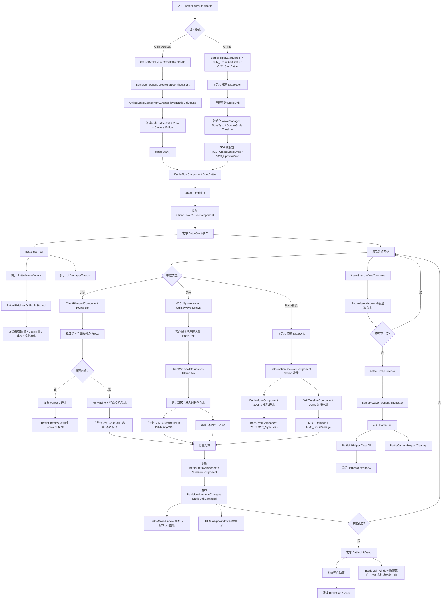

```mermaid
flowchart TD
    A["入口: BattleEntry.StartBattle"] --> B{"战斗模式"}

    B -->|Offline/Debug| C["OfflineBattleHelper.StartOfflineBattle"]
    B -->|Online| D["BattleHelper.StartBattle -> C2M_TeamStartBattle / C2M_StartBattle"]

    C --> C1["BattleComponent.CreateBattleWithoutStart"]
    C1 --> C2["OfflineBattleComponent.CreatePlayerBattleUnitAsync"]
    C2 --> C3["创建玩家 BattleUnit + View + Camera Follow"]
    C3 --> C4["battle.Start()"]

    D --> D1["服务端创建 BattleRoom"]
    D1 --> D2["创建英雄 BattleUnit"]
    D2 --> D3["初始化 WaveManager / BossSync / SpatialGrid / Timeline"]
    D3 --> D4["客户端收到 M2C_CreateBattleUnits / M2C_SpawnWave"]

    C4 --> E["BattleFlowComponent.StartBattle"]
    D4 --> E

    E --> E1["State = Fighting"]
    E1 --> E2["添加 ClientPlayerAITickComponent"]
    E2 --> E3["发布 BattleStart 事件"]

    E3 --> F["BattleStart_UI"]
    F --> F1["打开 BattleMainWindow"]
    F --> F2["打开 UIDamageWindow"]
    F1 --> F3["BattleUIHelper.OnBattleStarted"]
    F3 --> F4["刷新玩家血量 / Boss血量 / 波次 / 控制模式"]

    E3 --> G["波次系统开始"]
    G --> G1{"单位类型"}

    G1 -->|玩家| H["ClientPlayerAIComponent 100ms tick"]
    H --> H1["找目标 + 判断技能射程/CD"]
    H1 --> H2{"是否可攻击"}
    H2 -->|否| H3["设置 Forward 追击"]
    H2 -->|是| H4["Forward=0 + 释放技能/攻击"]
    H3 --> H5["BattleUnitView 每帧按 Forward 移动"]
    H4 --> H6["在线: C2M_CastSkill / 离线: 本地模拟"]

    G1 -->|杂兵| I["M2C_SpawnWave / OfflineWave Spawn"]
    I --> I1["客户端本地创建大量 BattleUnit"]
    I1 --> I2["ClientMinionAIComponent 100ms tick"]
    I2 --> I3["追击玩家 / 进入射程后攻击"]
    I3 --> I4["在线: C2M_ClientBatchHit 上报服务端验证"]
    I3 --> I5["离线: 本地伤害模拟"]

    G1 -->|Boss/精英| J["服务端权威 BattleUnit"]
    J --> J1["BattleActionDecisionComponent 100ms 决策"]
    J1 --> J2["BattleMoveComponent 100ms 移动/追击"]
    J1 --> J3["SkillTimelineComponent 20ms 碰撞检测"]
    J2 --> J4["BossSyncComponent 20Hz M2C_SyncBoss"]
    J3 --> J5["M2C_Damage / M2C_BossDamage"]

    H6 --> K["伤害结算"]
    I4 --> K
    I5 --> K
    J5 --> K

    K --> K1["更新 BattleStatsComponent / NumericComponent"]
    K1 --> K2["发布 BattleUnitNumericChange / BattleUnitDamaged"]
    K2 --> K3["BattleMainWindow 刷新玩家/Boss血条"]
    K2 --> K4["UIDamageWindow 显示飘字"]
    K2 --> K5{"单位死亡?"}

    K5 -->|否| G
    K5 -->|是| L["发布 BattleUnitDead"]
    L --> L1["播放死亡动画"]
    L1 --> L2["清理 BattleUnit / View"]
    L --> L3["BattleMainWindow 隐藏死亡 Boss 或刷新玩家 0 血"]

    G --> M["WaveStart / WaveComplete"]
    M --> M1["BattleMainWindow 刷新波次文本"]
    M1 --> M2{"还有下一波?"}
    M2 -->|是| G
    M2 -->|否| N["battle.End(success)"]

    N --> N1["BattleFlowComponent.EndBattle"]
    N1 --> N2["发布 BattleEnd"]
    N2 --> N3["BattleUIHelper.ClearAll"]
    N3 --> N4["关闭 BattleMainWindow"]
    N2 --> N5["BattleCameraHelper.Cleanup"]
```